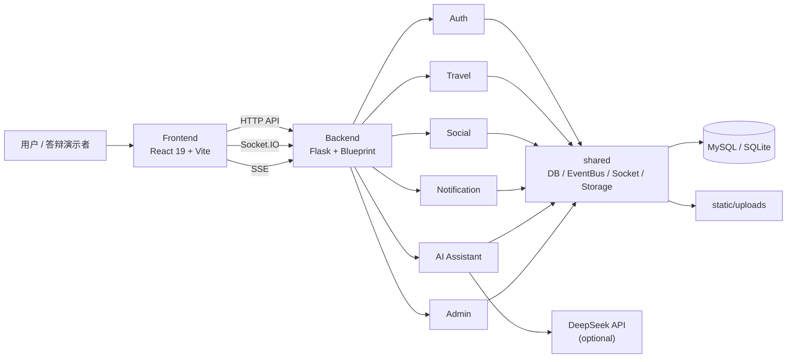
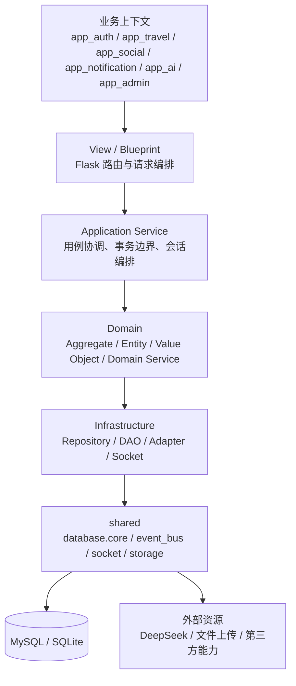
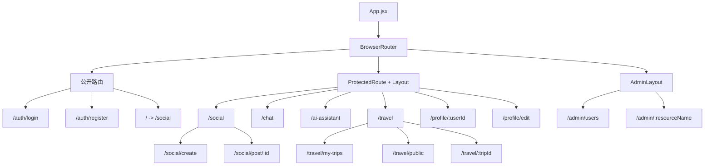
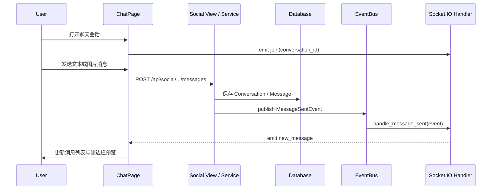
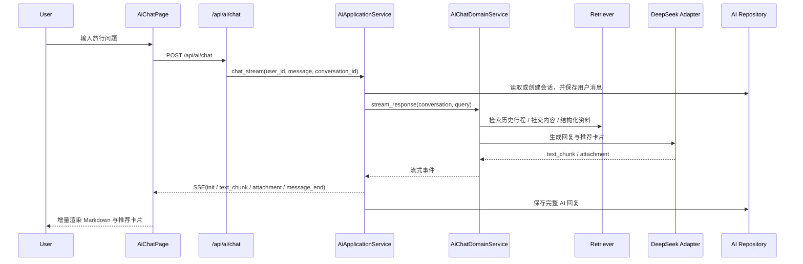
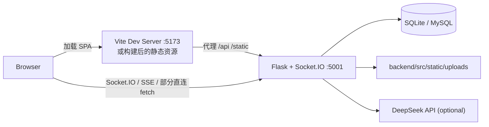

# TravelShare


TravelShare 是一个面向“行前规划、行中协作、行后分享”的旅行共享平台。项目采用前后端分离架构，前端基于 React + Vite，后端基于 Flask + SQLAlchemy，覆盖用户认证、旅行行程、社交广场、即时聊天、实时通知、AI 旅行助手和后台管理等能力。

## 项目亮点

- 旅行全周期闭环：从攻略准备、组队出行，到动态分享和互动社交。
- 模块边界清晰：后端按 `auth`、`travel`、`social`、`notification`、`ai`、`admin` 组织，配合 `shared` 共享内核。
- 交互协议丰富：HTTP API 承载主业务流，Socket.IO 支撑聊天推送，SSE 支撑 AI 流式回复。
- 课程答辩友好：根目录 README、`docs/`、`doc/` 和 `PlantUML/` 构成分层文档入口，便于展示与演进。

## 系统概览



## 架构与设计图表

### 1. 后端分层与限界上下文



### 2. 前端页面与路由组织



### 3. 实时聊天消息链路



### 4. AI 助手流式问答链路



### 5. 本地联调与部署视图



## 仓库结构

| 路径 | 说明 |
| --- | --- |
| `frontend/` | React + Vite 前端应用，负责页面、路由、组件和接口调用。 |
| `backend/` | Flask 后端服务，包含领域模块、数据库访问、接口视图和测试。 |
| `docs/` | 面向开发者的仓库导航文档，帮助快速理解项目与协作方式。 |
| `doc/` | 课程需求、架构设计和详细设计文档，保留原有课设材料。 |
| `PlantUML/` | 设计建模素材与图表源文件。 |
| `.github/` | Issue/PR 模板与 CI 工作流。 |

更详细的目录说明见 [docs/repository-map.md](docs/repository-map.md)。

## 功能模块

- `Auth`：注册、登录、个人资料、密码修改与重置。
- `Travel`：行程创建、日程活动管理、成员协作、公共行程浏览。
- `Social`：动态发布、评论点赞、好友关系、聊天会话与群聊协作。
- `Notification`：跨上下文通知与消息提醒能力。
- `AI`：接入 DeepSeek 的旅行问答、推荐卡片与流式生成。
- `Admin`：后台数据查看与资源管理能力。
- `Shared`：数据库连接、事件总线、Socket.IO 实例和本地文件存储。

## 技术栈

- 前端：React 19、Vite 7、React Router、Axios、Socket.IO Client、React Markdown
- 后端：Flask、Flask-Cors、SQLAlchemy、PyMySQL、Flask-SocketIO
- AI：LangChain、langchain-openai、langchain-community、DeepSeek API
- 交互协议：REST API、Socket.IO、SSE
- 测试：Pytest
- 文档：Markdown、Mermaid、PlantUML

## 快速开始

### 环境要求

- Node.js 20+
- Python 3.10+
- MySQL 8+（可选；未配置时后端默认回退到 SQLite）

### 1. 启动后端

```bash
cd backend
python -m venv .venv

# Windows
.venv\Scripts\activate
copy .env.example .env

# macOS / Linux
source .venv/bin/activate
cp .env.example .env

pip install -r requirements.txt
python src/app.py
```

后端默认运行在 `http://localhost:5001`。

### 2. 启动前端

```bash
cd frontend
npm install
npm run dev
```

前端默认运行在 `http://localhost:5173`。开发环境下，Vite 会把 `/api` 和 `/static` 代理到后端服务；聊天与 AI 场景还会直接连接 `5001` 端口上的 Socket.IO / SSE 能力。

### 3. 运行验证

```bash
# backend smoke test
cd backend
python -m pytest tests/integration/view/test_auth_view.py -q

# frontend
cd frontend
npm run lint
npm run build
```

如果你已经准备好了 MySQL、本地测试数据以及外部服务配置，也可以在 `backend/` 下执行完整的 `python -m pytest`。当前仓库中的部分集成测试依赖真实数据库或第三方接口，因此默认更推荐先跑上面的 smoke 流程。

## 配置说明

后端当前支持的关键环境变量：

| 变量 | 说明 | 默认值 |
| --- | --- | --- |
| `DATABASE_URL` | 数据库连接串 | `sqlite:///./travel_sharing.db` |
| `FLASK_SECRET_KEY` | Flask 会话密钥 | `travel-sharing-dev-secret` |
| `DEEPSEEK_API_KEY` | DeepSeek API Key | 无 |
| `DEEPSEEK_BASE_URL` | DeepSeek 服务地址 | `https://api.deepseek.com` |

示例配置见 [backend/.env.example](backend/.env.example)。

## 文档入口

- [docs/README.md](docs/README.md)：仓库文档导航
- [docs/getting-started.md](docs/getting-started.md)：本地开发与联调步骤
- [docs/repository-map.md](docs/repository-map.md)：仓库结构说明与维护约定
- [backend/README.md](backend/README.md)：后端单独说明
- [frontend/README.md](frontend/README.md)：前端单独说明
- [doc/requirements/](doc/requirements/)：课程需求文档
- [doc/design/](doc/design/)：架构设计与详细设计文档
- [PlantUML/](PlantUML/)：图表源文件与建模素材

## 协作与规范

- 提交问题前，请先查看 [`.github/ISSUE_TEMPLATE/`](.github/ISSUE_TEMPLATE/)
- 提交代码前，请阅读 [CONTRIBUTING.md](CONTRIBUTING.md)
- 协作行为约定见 [CODE_OF_CONDUCT.md](CODE_OF_CONDUCT.md)
- 安全问题处理方式见 [SECURITY.md](SECURITY.md)
- 本次仓库规范化变更记录见 [CHANGELOG.md](CHANGELOG.md)

## 许可证

本项目采用 [MIT License](LICENSE)。

## 设计说明

这次仓库重构与 README 补充遵循以下原则：

- 不打断现有课程文档的编写节奏，因此保留 `doc/` 原目录不搬迁。
- 把“仓库入口层”统一到根目录和 `docs/`，让第一次进入项目的人更快找到启动方式。
- 用 Mermaid 在 README 中直接表达系统上下文、分层结构、页面组织和关键时序，降低答辩讲解成本。
- 通过 `shared` 共享内核、事件总线和统一存储入口，尽量减少跨模块重复实现。
