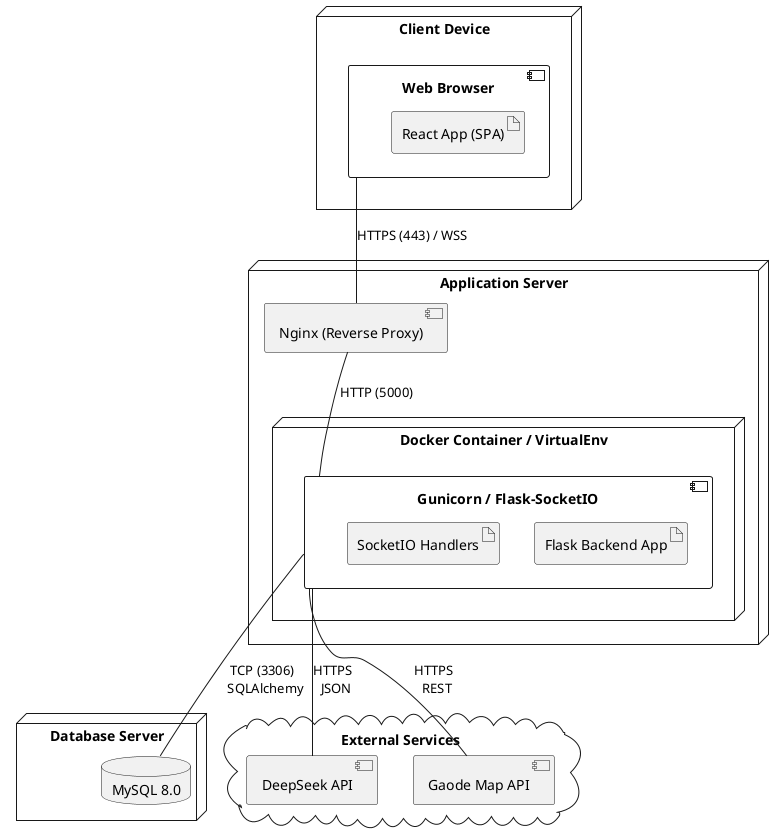

# 部署视图 (Deployment View)

## 1. 简介

部署视图 (Deployment View) 描述了软件系统如何映射到物理硬件或虚拟化基础设施上。它关注系统的物理拓扑结构、节点（Nodes）的分布、网络通信协议以及组件在运行时环境中的部署位置。

本视图旨在指导运维人员和开发人员完成“旅行信息分享应用”的安装、配置和发布，确保系统满足可用性、安全性及性能需求。虽然作为课程设计项目，当前环境可能仅为单机开发环境，但本设计依然遵循生产就绪 (Production-Ready) 的标准进行规划。

---

## 2. 物理节点与拓扑结构

系统采用经典的 **三层架构 (Three-Tier Architecture)** 进行部署：**客户端层**、**应用服务器层** 和 **数据持久化层**。在实际生产环境中，这三层通常部署在不同的服务器或容器集群中，并通过网络进行通信。

### 2.1 节点类型定义

#### 2.1.1 客户端节点 (Client Node)
*   **设备**: 用户的个人电脑 (PC/Mac) 或移动设备 (iOS/Android)。
*   **软件环境**: 现代 Web 浏览器 (Chrome 80+, Safari 13+, Edge)。
*   **部署制品**: 前端静态资源包 (HTML, CSS, JavaScript Bundle)。这些资源在首次访问时下载并缓存在本地。

#### 2.1.2 Web 服务器节点 (Web Server Node)
*   **设备**: Linux 服务器 (Ubuntu 22.04 LTS) 或 Docker 容器。
*   **软件环境**:
    *   **Nginx**: 作为反向代理服务器，处理静态文件服务、SSL 终结和请求转发。
    *   **Gunicorn**: Python WSGI HTTP 服务器，运行 Flask 应用。
    *   **Python Runtime**: Python 3.9+ 环境。
*   **部署制品**: 后端应用程序代码 (`backend/src/`), Python 依赖库 (`site-packages`).

#### 2.1.3 数据库服务器节点 (Database Server Node)
*   **设备**: 专用的高性能 I/O 优化服务器或云数据库实例 (如 RDS)。
*   **软件环境**: MySQL Community Server 8.0。
*   **部署制品**: 数据库文件 (Data Files), 配置文件 (`my.cnf`), 备份脚本。

#### 2.1.4 外部服务节点 (External Service Nodes)
系统依赖两个关键的外部 SaaS 服务，不属于我们管理的物理节点，但在拓扑中至关重要：
*   **AI 推理云 (DeepSeek Cloud)**: 提供 LLM API 服务。
*   **高德地图服务 (AMap Cloud)**: 提供 GIS 数据和路径规划计算服务。

### 2.2 部署拓扑图 (UML Deployment Diagram)



---

## 3. 网络通信与协议

各节点之间的通信依赖于标准的 TCP/IP 协议栈。

### 3.1 公网通信 (Internet)
*   **Client <-> Server**:
    *   **HTTP/1.1 或 HTTP/2**: 用于加载页面、REST API 调用 (GET, POST)。
    *   **WebSocket (WSS)**: 用于实时聊天消息推送。
    *   **TLS/SSL**: 所有公网传输必须加密（HTTPS），证书由 Nginx 管理。

### 3.2 内网/局域网通信 (Intranet/LAN)
*   **Nginx <-> Gunicorn**: 通过 Loopback (127.0.0.1) 或 Docker Bridge 网络进行纯 HTTP 通信，减少加密开销。
*   **App Server <-> MySQL**: 使用 TCP 协议，端口 3306。连接字符串通过环境变量注入。建议启用 SSL 连接以增强安全性，即使在内网。

### 3.3 外部 API 通信
*   **App Server <-> DeepSeek/Gaode**: 均为 HTTPS 请求。服务器作为客户端发起 Outbound 连接。需要配置防火墙允许 443 端口的出站流量。

---

## 4. 详细部署方案

本节描述从源码到运行服务的具体步骤。

### 4.1 前端部署构建
前端 React 项目不是直接把源码放到服务器上运行，而是需要经过 **构建 (Build)** 过程。
1.  **环境准备**: 安装 Node.js 和 npm。
2.  **构建命令**: 在 `frontend/` 目录下运行 `npm run build`。
3.  **产物**: 生成 `dist/` 目录，包含 `index.html` 和混淆压缩后的 `assets/*.js`, `assets/*.css`。
4.  **部署**: 将 `dist/` 目录下的所有文件复制到 Nginx 的静态资源目录（例如 `/var/www/travel_sharing/html`）。

### 4.2 后端部署配置
后端应用通常运行在 Docker 容器中以保证环境一致性，或直接运行在 Linux 主机上。

#### 4.2.1 依赖安装
使用 `pip` 安装依赖，建议使用虚拟环境：
```bash
python3 -m venv venv
source venv/bin/activate
pip install -r backend/requirements.txt
pip install gunicorn eventlet  # 生产环境专用依赖
```

#### 4.2.2 环境变量配置 (.env)
在服务器 `/app/backend` 目录下创建 `.env` 文件，填入敏感信息：
```ini
FLASK_APP=src/app.py
FLASK_ENV=production
SECRET_KEY=<Generated_Random_Strong_String>
DATABASE_URL=mysql+pymysql://user:password@db_server_ip:3306/travel_sharing_db
DEEPSEEK_API_KEY=sk-xxxxxx
GAODE_KEY=xxxxxx
```

#### 4.2.3 启动命令 (Gunicorn)
由于应用使用了 Flask-SocketIO，必须使用支持 WebSocket 的 Worker 类型（如 `eventlet`）：
```bash
gunicorn --worker-class eventlet -w 1 --bind 0.0.0.0:5000 src.app:app
```
*注意：SocketIO 在多 Worker 模式下需要 Redis 支持。若无 Redis，只能开启 1 个 Worker (`-w 1`)。*

### 4.3 Nginx 反向代理配置
Nginx 是系统的流量入口。它负责将 `/api` 开头的请求转发给 Gunicorn，将 `/socket.io` 的 WebSocket 连接升级并转发，其余请求则直接返回前端静态文件。

```nginx
server {
    listen 80;
    server_name travel.example.com;

    # 前端静态文件
    location / {
        root /var/www/travel_sharing/html;
        index index.html;
        try_files $uri $uri/ /index.html;  # 支持 React Router 的 History 模式
    }

    # 后端 API 接口
    location /api {
        proxy_pass http://127.0.0.1:5000;
        proxy_set_header Host $host;
        proxy_set_header X-Real-IP $remote_addr;
    }

    # WebSocket 支持
    location /socket.io {
        proxy_pass http://127.0.0.1:5000/socket.io;
        proxy_http_version 1.1;
        proxy_set_header Upgrade $http_upgrade;
        proxy_set_header Connection "upgrade";
    }
}
```

---

## 5. 可伸缩性与高可用性规划 (Scalability & HA)

虽然当前是单机部署，但架构设计预留了扩展能力。

### 5.1 水平扩展 (Horizontal Scaling)
当并发用户数增加时，可以通过增加应用服务器节点来分担负载。
1.  **无状态 API**: REST API 是无状态的，可以直接部署 N 个副本，通过 Nginx 轮询 (Round Robin) 负载均衡。
2.  **有状态 WebSocket**: 若部署多个后端副本，客户端 A 连接到 Server 1，客户端 B 连接到 Server 2，它们之间无法直接通信。
    *   **解决方案**: 引入 **Redis**。配置 Flask-SocketIO 使用 Redis 作为消息队列 (`message_queue='redis://...'`)。Server 1 收到消息后发布到 Redis，Redis 广播给 Server 2，Server 2 再推送到客户端 B。

### 5.2 数据库扩展
*   **读写分离**: 部署 MySQL 主从复制 (Master-Slave)。所有写操作 (INSERT/UPDATE) 发往 Master，读操作 (SELECT) 发往 Slave。
*   **连接池优化**: 应用侧配置 SQLAlchemy 的连接池大小 (`pool_size`)，避免过量连接压垮数据库。

---

## 6. 安全部署策略

### 6.1 最小权限原则
*   **数据库用户**: 应用程序使用的 MySQL 账号不应拥有 `DROP TABLE` 或 `GRANT` 权限，仅保留 `SELECT, INSERT, UPDATE, DELETE`。
*   **系统用户**: Gunicorn 进程不应以 `root` 用户运行，应创建专用的 `www-data` 或 `appuser` 用户。

### 6.2 敏感数据保护
*   **API Key**: 严禁将 DeepSeek 和高德地图的 API Key 硬编码在代码中，必须通过环境变量注入。
*   **HTTPS**: 生产环境强制开启 HTTPS，防止 Token 在传输过程中被中间人劫持。

---

## 7. 监控与日志

### 7.1 日志管理
*   **应用日志**: Flask 配置将日志输出到 `stdout/stderr`，由 Docker 驱动或 Supervisor 收集并写入文件（如 `/var/log/travel_app.log`）。
*   **Nginx 日志**: 记录所有访问请求 (`access.log`) 和 错误信息 (`error.log`)，用于流量分析和故障排查。

### 7.2 健康检查
*   应用应暴露 `/health` 端点，返回简单的 `200 OK`。
*   负载均衡器或 Docker Healthcheck 定期调用该端点。如果连续失败，自动重启容器或将流量切断。

---

## 8. 总结

本部署视图提供了一个从单机开发环境平滑过渡到生产环境的蓝图。通过引入 Nginx 反向代理、分离前后端构建产物以及规范化的环境变量配置，我们构建了一个结构清晰、安全且易于维护的运行时环境。特别是针对 WebSocket 和 AI 服务的特殊网络需求，本设计给出了明确的协议处理和代理配置方案，确保了核心功能的稳定运行。
