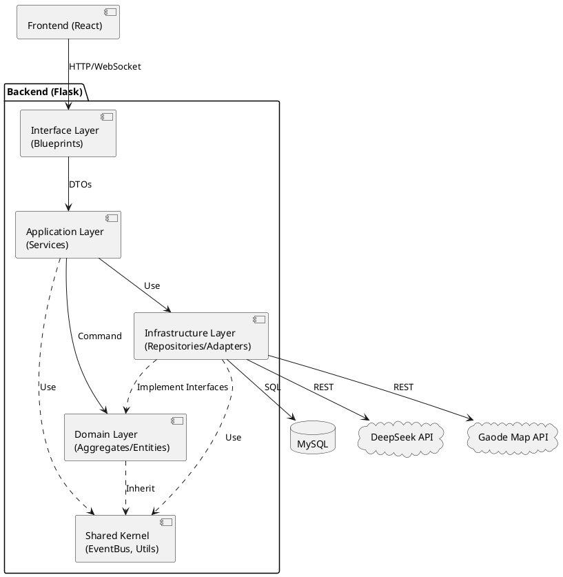

# 开发视图 (Development View)

## 1. 简介

开发视图 (Development View) 关注软件开发环境中的实际组织结构。它描述了软件模块的组织方式、包结构、分层依赖关系以及构建和配置管理策略。本视图的主要受众是开发人员和测试人员，旨在规范代码结构，确保团队协作的一致性。

本项目是一个前后端分离的 Web 应用，前端采用 React.js，后端采用 Python Flask。

---

## 2. 总体项目结构

项目根目录 `travel_sharing_app_v0/` 包含以下核心部分：

```text
travel_sharing_app_v0/
├── backend/                # 后端工程根目录 (Python)
│   ├── src/                # 源代码目录
│   ├── tests/              # 测试代码目录
│   ├── requirements.txt    # Python 依赖清单
│   └── .env                # 环境变量配置
├── frontend/               # 前端工程根目录 (React + Vite)
│   ├── src/                # 前端源代码
│   ├── public/             # 静态资源
│   └── package.json        # Node.js 依赖清单
├── doc/                    # 项目文档
└── README.md               # 项目入口说明
```

---

## 3. 后端开发架构 (Backend)

后端采用 **模块化单体 (Modular Monolith)** 架构，严格遵循领域驱动设计 (DDD) 的分层原则。

### 3.1 源码目录结构 (`backend/src/`)

Python 包的组织直接映射了系统的限界上下文。

| 包名 | 类型 | 职责描述 |
| :--- | :--- | :--- |
| `app.py` | 入口 | Flask 应用工厂，负责注册 Blueprints、初始化扩展 (DB, SocketIO, CORS)。 |
| `app_auth/` | 模块 | 用户认证与授权模块。 |
| `app_travel/` | 模块 | 旅行核心业务模块（行程、活动、路线）。 |
| `app_social/` | 模块 | 社交互动模块（帖子、评论、聊天）。 |
| `app_ai/` | 模块 | AI 助手模块（RAG, LLM 集成）。 |
| `app_admin/` | 模块 | 后台管理模块。 |
| `shared/` | 内核 | 共享内核，包含所有模块共用的基础组件。 |

### 3.2 模块内部结构规范

每个业务模块（如 `app_travel`）内部必须严格遵守以下分层结构：

```text
app_travel/
├── __init__.py           # 暴露模块的 Blueprint 和对外接口
├── domain/               # [领域层] 纯业务逻辑，无外部依赖
│   ├── aggregate/        # 聚合根 (如 trip_aggregate.py)
│   ├── entity/           # 实体 (如 trip_day_entity.py)
│   ├── value_object/     # 值对象 (如 money.py)
│   ├── event/            # 领域事件定义 (如 trip_events.py)
│   ├── service/          # 领域服务 (如 itinerary_service.py)
│   └── repository.py     # 仓储接口定义 (ITripRepository)
├── infrastructure/       # [基础设施层] 技术实现细节
│   ├── persistence/      # 数据库持久化
│   │   ├── models.py     # SQLAlchemy ORM 模型 (PO)
│   │   └── repository_impl.py # 仓储接口实现
│   └── adapter/          # 外部服务适配器 (如 gaode_map_service.py)
├── services/             # [应用层] 用例编排
│   └── travel_service.py # 应用服务，管理事务与事件发布
└── view/                 # [接口层] Web API
    └── travel_view.py    # Flask 路由定义，处理 HTTP 请求
```

### 3.3 模块间依赖规则

为了防止架构腐化，必须遵守严格的依赖方向：

1.  **分层依赖**: `View` -> `Application` -> `Domain` <- `Infrastructure` (依赖倒置)。
2.  **模块间依赖**:
    *   `app_travel`, `app_social` 等上层业务模块 **可以依赖** `shared` 模块。
    *   `app_social` **可以依赖** `app_auth` (获取用户信息) 和 `app_travel` (关联行程)。
    *   **禁止循环依赖**：例如 `app_travel` 不应依赖 `app_social`。如果 Trip 完成时需要发 Feed，应通过**发布领域事件**解耦，而不是直接调用 `SocialService`。

### 3.4 后端组件依赖图 (UML Component Diagram)



---

## 4. 前端开发架构 (Frontend)

前端应用基于 `React 18` + `Vite` 构建，采用组件化和 Hooks 模式。

### 4.1 源码目录结构 (`frontend/src/`)

| 目录 | 职责 |
| :--- | :--- |
| `api/` | 封装 Axios 请求，定义与后端的 API 接口函数 (如 `travelApi.js`)。 |
| `assets/` | 静态资源（图片、图标）。 |
| `components/` | 通用 UI 组件（如 `Navbar`, `Button`, `Card`）。 |
| `context/` | 全局状态管理（`AuthContext` 用于存用户信息，`SocketContext` 用于 WebSocket 连接）。 |
| `hooks/` | 自定义 Hooks（如 `useForm`, `useChat`）。 |
| `pages/` | 页面级组件（路由入口，如 `TripDetail`, `SocialFeed`）。 |
| `styles/` | 全局 CSS 或 styled-components 定义。 |
| `App.jsx` | 根组件，配置 React Router。 |

### 4.2 关键开发规范

1.  **组件拆分**: 页面组件 (`pages/`) 负责数据获取 (Data Fetching) 和布局；展示组件 (`components/`) 负责渲染 UI，尽量保持无状态 (Stateless)。
2.  **状态管理**:
    *   局部状态使用 `useState`。
    *   跨组件状态（如当前用户、Socket 连接）使用 `React Context`。
    *   数据缓存与异步状态推荐使用 `swr` 或 `react-query` (本项目目前主要手动管理 useEffect)。
3.  **API 调用**: 禁止在组件内直接使用 `fetch` 或 `axios.get`。必须通过 `api/` 目录下的封装函数调用，以便统一管理 URL 和错误处理。

---

## 5. 构建与配置管理

### 5.1 依赖管理
*   **后端**: 使用 `pip` 和 `requirements.txt`。开发环境推荐使用 `venv` 虚拟环境。
*   **前端**: 使用 `npm` 和 `package.json`。

### 5.2 环境变量
项目使用 `.env` 文件隔离不同环境（开发、测试、生产）的配置。
*   `FLASK_APP`: 入口文件。
*   `FLASK_ENV`: `development` 或 `production`。
*   `DATABASE_URL`: 数据库连接字符串。
*   `DEEPSEEK_API_KEY`: AI 服务密钥。
*   `GAODE_KEY`: 地图服务密钥。

### 5.3 数据库迁移
虽然使用了 SQLAlchemy ORM，但为了简化课程设计，目前主要依赖 `db_scripts/init_db.py` 进行全量初始化。生产环境建议引入 `Flask-Migrate` (Alembic) 进行版本化迁移。

---

## 6. 测试策略

### 6.1 后端测试 (`backend/tests/`)
采用 `pytest` 框架。
*   **单元测试 (`unit/`)**: 针对 Domain 层和 Service 层。使用 `unittest.mock` 模拟数据库和外部 API，专注于业务逻辑验证。
*   **集成测试 (`integration/`)**: 针对 Repository 层和 View 层。连接测试数据库 (`test_db`)，验证 SQL 执行正确性和 API 端点响应。

### 6.2 测试执行
开发人员在提交代码前应运行：
```bash
pytest
```
确保所有测试用例通过。

---

## 7. 总结

开发视图不仅定义了代码的物理结构，更规定了团队协作的契约。通过严格的模块划分和分层约束，我们确保了前端关注交互体验，后端关注业务逻辑，基础设施关注技术实现，从而构建出一个清晰、可维护的软件系统。
