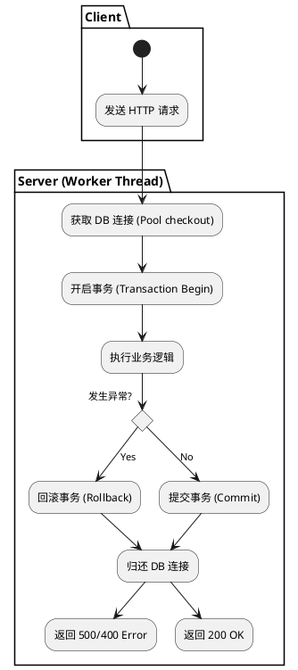
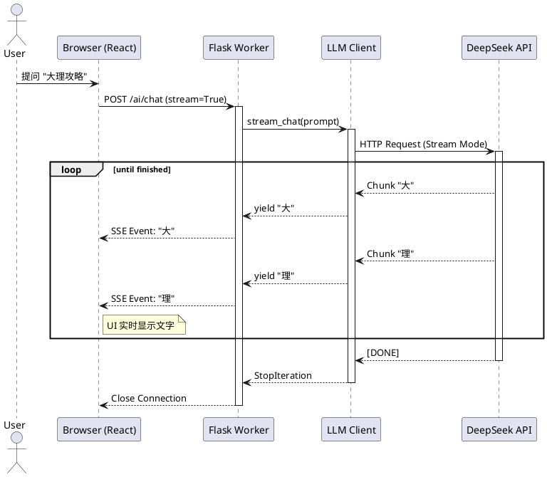
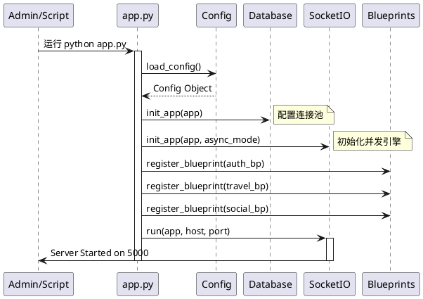

# 过程视图 (Process View)

## 1. 简介

过程视图 (Process View) 侧重于系统的运行时特性，描述了系统中的进程 (Process)、线程 (Thread) 以及它们之间的并发 (Concurrency)、同步 (Synchronization) 和通信 (Communication) 机制。

本视图旨在解决系统的性能、可伸缩性以及系统吞吐量等非功能性需求。对于“旅行信息分享应用”而言，过程视图重点关注 **Flask Web 服务器的并发请求处理**、**WebSocket 实时通信的连接管理** 以及 **AI 推理任务的流式处理**。

---

## 2. 系统进程架构

在运行时环境中，系统主要由以下独立运行的进程组成：

### 2.1 客户端进程 (Client Process)
*   **运行环境**: 用户浏览器 (Chrome, Edge, etc.)。
*   **技术栈**: React Single Page Application (SPA), JavaScript Runtime.
*   **并发模型**: 单线程事件循环 (Single-threaded Event Loop)。
*   **职责**:
    *   渲染 UI 组件。
    *   通过 `Fetch API` / `Axios` 发起异步 HTTP 请求。
    *   维护 `WebSocket` 长连接，监听服务端推送事件。

### 2.2 Web 服务器进程 (Server Process)
*   **运行环境**: Python Runtime (宿主机或 Docker 容器)。
*   **技术栈**: Flask, Flask-SocketIO, Gunicorn (生产环境) / Werkzeug (开发环境)。
*   **并发模型**:
    *   **HTTP**: 基于线程池 (ThreadPool) 或 协程 (Geoz/Eventlet) 的并发模型。
    *   **WebSocket**: 基于协程 (Greenlets via Eventlet/Gevent) 的高并发 I/O 多路复用。
*   **职责**:
    *   处理 RESTful API 请求。
    *   维护 WebSocket 会话状态。
    *   执行业务逻辑与数据库交互。

### 2.3 数据库进程 (Database Process)
*   **运行环境**: MySQL Server 8.0 Daemon。
*   **职责**:
    *   数据持久化存储。
    *   处理 SQL 查询与事务 (Transactions)。
    *   维护行级锁 (Row-level Locking) 以保证数据一致性。

---

## 3. 并发处理模型

### 3.1 HTTP 请求的并发处理

Flask 本身是同步的 WSGI 框架。为了支持并发，我们依赖 WSGI 容器（如 Gunicorn）或开发服务器的多线程能力。

1.  **请求隔离**: 每个 HTTP 请求被分配给一个独立的 **工作线程 (Worker Thread)** 或 **协程 (Greenlet)**。
2.  **上下文管理**: Flask 使用 `Thread Local` 存储技术（通过 `werkzeug.local` 实现），确保 `request`、`g` (全局临时对象) 和 `session` 对象在不同线程间是严格隔离的。
    *   *过程*: 当请求到达时，Flask 将请求上下文压入栈；处理结束后，弹出栈并清理。
3.  **数据库连接池**: 使用 SQLAlchemy 的 `QueuePool`。
    *   每个请求线程从池中获取一个连接。
    *   请求处理期间独占该连接。
    *   请求结束时（Response 返回前），连接归还到池中。

#### HTTP 请求处理活动图

### 3.2 WebSocket 实时通信的并发

本项目集成了 `Flask-SocketIO`，这引入了不同的并发需求。WebSocket 连接是长连接，如果每个连接占用一个线程，服务器资源将迅速耗尽。

1.  **协程模型**: 生产环境推荐使用 **Eventlet** 或 **Gevent**。它们使用“绿线程” (Green Threads)，在单操作系统线程内通过非阻塞 I/O 实现数千个并发连接。
2.  **事件循环**: 服务器运行一个主事件循环，轮询 socket 状态。
3.  **消息广播**:
    *   当业务逻辑（可能运行在常规 HTTP 线程中）需要推送消息时，它通过 `Redis` (作为 Message Queue) 或进程内内存（单机模式）将消息传递给 SocketIO 管理器。
    *   SocketIO 管理器在下一次事件循环tick中，将数据写入对应的客户端 socket。

### 3.3 AI 推理的流式处理 (Streaming)

AI 生成（如 DeepSeek）通常耗时较长（数秒到数十秒）。如果采用传统的“请求-等待-响应”模式，会导致 HTTP 连接超时且用户体验极差。因此，我们采用 **Server-Sent Events (SSE)** 或 **分块传输 (Chunked Transfer)**。

1.  **生成器模式**: Controller 函数不直接返回字符串，而是返回一个 Python `Generator`。
2.  **非阻塞写入**: 
    *   生成器内部循环调用 LLM API 获取数据块 (Chunk)。
    *   每获取一个 Chunk，通过 `yield` 关键字立即发送给 WSGI 服务器。
    *   WSGI 服务器将其 flush 到 TCP 缓冲区发送给客户端。
3.  **线程占用**: 注意，虽然响应是流式的，但在 Python 同步模式下，**该请求依然会一直占用一个 Worker 线程**，直到生成结束。因此，对于高并发 AI 应用，增加 Worker 数量或使用 Async IO 是必要的优化方向。

#### AI 流式响应序列图

---

## 4. 同步与数据一致性

在多线程/多进程环境下，共享资源的访问必须同步。

### 4.1 数据库事务 (Transactions)
*   **策略**: 悲观锁 (Implicit via SQL) 与 乐观锁 (Application level)。
*   **实现**: 
    *   所有写操作必须封装在 `try...except...finally` 块中。
    *   在 `finally` 块或 `teardown_request` 钩子中确保 `session.remove()` 被调用，防止连接泄漏。
    *   对于库存扣减、余额变更等高冲突操作，使用 `SELECT ... FOR UPDATE` (虽本项目较少涉及，但原则如此)。

### 4.2 线程安全 (Thread Safety)
*   **全局对象**: Flask 的 `current_app`, `g`, `request` 是线程安全的（通过 LocalProxy 代理到 ThreadLocal 存储）。
*   **单例服务**: `Service` 类通常设计为**无状态 (Stateless)** 单例。即 Service 实例内部不存储请求相关的数据，所有状态通过参数传递。这避免了多线程并发调用同一个 Service 实例时的数据污染。

---

## 5. 启动与初始化流程

系统启动是一个串行的过程，确保所有依赖资源准备就绪。

1.  **加载配置**: 读取环境变量和 `.env` 文件。
2.  **初始化扩展**: `db.init_app(app)`, `socketio.init_app(app)`.
3.  **注册蓝图**: 挂载所有模块的路由。
4.  **构建依赖图**: 在内存中建立 Service 与 Repository 的映射（虽然 Python 是动态语言，通常在 import 时完成）。
5.  **启动服务器**: `socketio.run(app)` 启动 Web Server，绑定端口，开启监听。

#### 系统启动时序图

---

## 6. 性能与可伸缩性考量

### 6.1 瓶颈分析
*   **CPU 密集型**: 图像处理（如缩放上传图片）、大量 JSON 序列化。会阻塞 GIL (Global Interpreter Lock)，影响并发。
    *   *对策*: 将繁重任务放入 Celery 任务队列（架构预留）。
*   **I/O 密集型**: 数据库查询、调用 AI API、地图 API。
    *   *对策*: 线程池或协程模型能有效应对。

### 6.2 扩展策略
*   **无状态 HTTP**: REST API 是无状态的，可以通过增加 Gunicorn Worker 数量或部署多个容器实例并通过 Nginx 负载均衡来水平扩展。
*   **有状态 WebSocket**: WebSocket 连接具有状态（连接属于特定进程）。如果水平扩展到多台服务器，必须引入 **Redis** 作为 SocketIO 的 Message Queue，以实现跨进程/跨服务器的消息广播。

---

## 7. 总结

本过程视图展示了系统如何在动态运行时处理并发请求。通过结合 Flask 的线程隔离机制、SQLAlchemy 的连接池管理以及 SocketIO 的协程模型，系统能够在保持代码逻辑简单的同时，提供足够的并发处理能力。特别是针对 AI 场景的流式响应设计，有效解决了长耗时任务对用户体验的影响。
