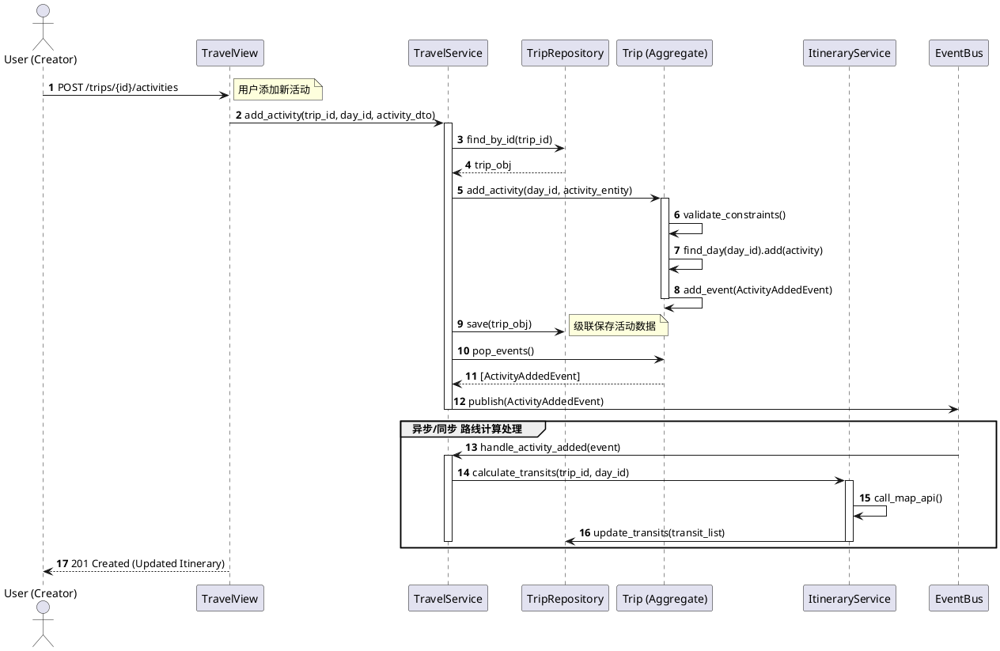
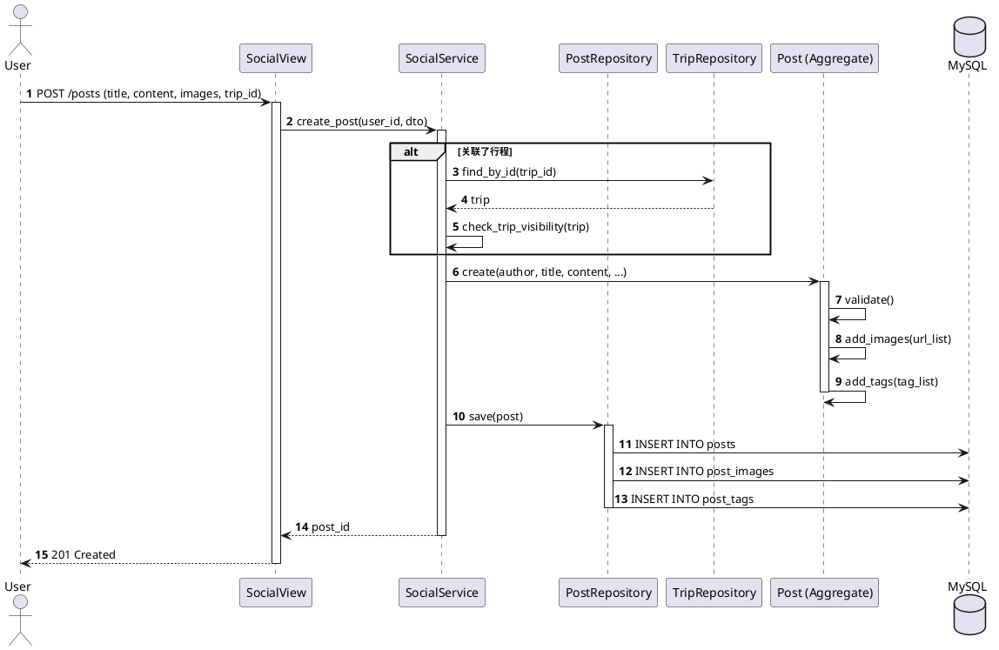
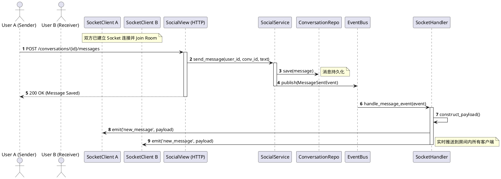
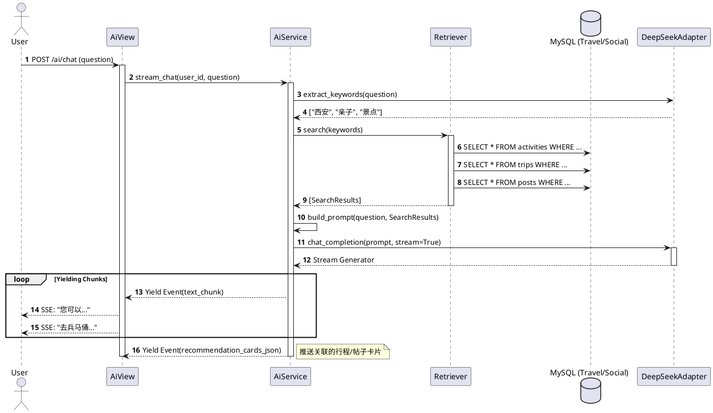

# 场景视图 (Scenario View)

## 1. 简介

场景视图 (Scenario View) 用于描述系统的参与者 (Actors) 与系统功能组件之间的交互过程。它通过具体的用例场景（Use Cases），将架构设计中的各个逻辑组件串联起来，验证系统架构是否能够满足业务需求。

本文档选取了“旅行信息分享应用”中最为核心且最具技术代表性的四个业务场景：**多人协同行程规划**、**社交动态发布**、**实时聊天**以及**AI 智能助手问答**。这些场景覆盖了系统中的事务处理、即时通讯、内容分发以及智能计算等不同类型的负载模式。

---

## 2. 参与者 (Actors)

在描述具体场景之前，首先定义与系统交互的主要参与者：

*   **普通用户 (User)**: 系统的主要使用者。可以创建行程、发布动态、发送消息、使用 AI 助手。
*   **行程创建者 (Trip Creator)**: 拥有特定行程管理权限（如邀请成员、修改预算、更改状态）的用户。
*   **系统管理员 (Admin)**: 负责后台数据管理、用户封禁、内容审核等运维操作。
*   **AI 引擎 (AI Engine)**: 外部系统参与者（集成 DeepSeek 大模型），负责生成自然语言回复。
*   **第三方地图服务 (Map Service)**: 外部系统参与者（高德地图），提供地理编码和路径规划能力。

---

## 3. 核心业务场景详解

### 3.1 场景一：多人协同行程规划 (Collaborative Trip Planning)

#### 3.1.1 场景描述
这是系统的核心业务价值所在。用户创建一个“大理三日游”的行程，并邀请好友加入。所有成员都可以向行程中添加具体的活动（如“游览崇圣寺三塔”），系统需要自动计算活动之间的交通路线，并实时更新给所有成员。此场景考验系统的事务一致性和领域逻辑的封装能力。

#### 3.1.2 详细流程步骤

1.  **创建行程**: 用户 A（Creator）通过前端表单提交行程基本信息（名称、起止日期、预算）。
    *   *后端处理*: `TravelService` 创建 `Trip` 聚合根，并初始化默认的 `TripDay` 实体。同时将用户 A 以 "OWNER" 角色加入 `TripMember` 列表。
2.  **邀请成员**: 用户 A 输入用户 B 的邮箱发起邀请。
    *   *后端处理*: `TravelService` 验证用户 B 存在，调用 `Trip.add_member()`。领域层执行校验（如行程是否已结束）。持久化后触发 `TripMemberAddedEvent`，通知系统发送站内信。
3.  **添加活动**: 用户 B 在行程第二天添加“洱海骑行”活动。
    *   *后端处理*: 前端调用 `POST /trips/{id}/days/{day_id}/activities`。`TravelService` 加载 `Trip` 聚合根。
    *   *领域逻辑*: `Trip` 委托 `TripDay` 实体执行 `add_activity()`。实体内部逻辑会检查时间冲突，并自动调整后续活动的顺序。
4.  **自动路线计算**: 活动添加成功后，触发 `ActivityAddedEvent`。
    *   *后端处理*: `TravelService`（或独立的 Event Handler）捕获事件，调用 `ItineraryService.calculate_routes()`。该服务对比相邻活动的位置，调用高德地图 API 获取交通方式（驾车/公交）及耗时，生成或更新 `Transit` 实体。
5.  **查看详情**: 用户 A 刷新页面，看到包含最新活动和交通路线的完整行程。

#### 3.1.3 交互时序图 (UML Sequence Diagram)

---

### 3.2 场景二：社交动态发布 (Social Feed Posting)

#### 3.2.1 场景描述
用户在旅行结束后，希望将行程中的照片和经历整理成一篇游记发布到社区广场。该场景涉及多媒体资源的处理、数据的关联（关联特定行程）以及读写分离的考量（发布是写，Feed 流是高频读）。

#### 3.2.2 详细流程步骤

1.  **图片上传**: 用户在编辑器中选择多张图片上传。
    *   *后端处理*: 图片先上传至文件服务器（或对象存储），后端返回图片 URL 列表。
2.  **内容撰写与提交**: 用户填写标题、正文，选择关联的行程（可选），添加标签（如“风景”、“美食”），点击发布。
3.  **聚合根创建**: `SocialService` 接收请求。创建 `Post` 聚合根。
    *   *关联处理*: 将图片 URL 列表封装为 `PostImage` 实体列表。将标签封装为 `PostTag` 实体列表。如果有 `trip_id`，验证行程可见性。
4.  **持久化**: `PostRepository` 将 Post 及其关联的 Images, Tags 保存至数据库。
5.  **分发**: 发布成功后，系统可能会将该帖子 ID 推送给关注者的 Timeline（本项目简化为拉模式，即查询时动态构建 Feed）。

#### 3.2.3 交互时序图 (UML Sequence Diagram)

---

### 3.3 场景三：基于 WebSocket 的实时聊天 (Real-time Chat)

#### 3.3.1 场景描述
用户在浏览其他人的主页时，发起私聊询问旅行建议。或者在行程群组中与同伴实时沟通。此场景展示了 HTTP 请求与 WebSocket 事件通知如何协同工作，即“REST for Action, WebSocket for Notification”模式。

#### 3.3.2 详细流程步骤

1.  **建立连接**: 用户进入聊天页面，前端通过 `socket.io-client` 连接后端。
    *   *后端处理*: `on_connect` 触发，通过 Session 识别用户身份，将 `socket_id` 加入以 `user_id` 命名的 Room（用于接收私信通知）。
2.  **加入会话**: 用户点击某个聊天窗口（Conversation A）。前端发送 `join` 事件。
    *   *后端处理*: 校验用户是否是 Conversation A 的成员。若是，调用 `join_room("conversation_A")`。
3.  **发送消息**: 用户输入文字并发送。**注意：这里走的是 HTTP POST 请求，而不是 Socket 事件**。
    *   *设计理由*: 保持业务逻辑在 Service 层的统一性，便于复用鉴权、存储、事务逻辑。
    *   *后端处理*: `SocialService.send_message()` 接收请求，保存 `Message` 到数据库。
4.  **事件广播**: 消息保存成功后，Service 层发布 `MessageSentEvent`。
    *   *事件处理*: `SocketEventHandler` 监听到该领域事件。
    *   *推送*: Handler 提取事件中的 `conversation_id` 和消息内容，调用 `socketio.emit('new_message', data, room=conversation_id)`。
5.  **接收消息**: 房间内的所有在线用户的 Socket 收到 `new_message` 事件，前端更新 UI。

#### 3.3.3 交互时序图 (UML Sequence Diagram)

---

### 3.4 场景四：AI 智能助手问答 (AI Travel Assistant with RAG)

#### 3.4.1 场景描述
用户向 AI 提问：“我带孩子去西安玩，有什么推荐的行程？”系统不能只依靠大模型的通用知识，还需要检索站内已有的优质亲子游记和热门景点数据，生成更具参考价值的回答（RAG - 检索增强生成）。

#### 3.4.2 详细流程步骤

1.  **用户提问**: 前端发送问题到 `POST /ai/chat`。
2.  **关键词提取**: `AiService` 首先调用 LLM 的轻量级接口，将自然语言问题转化为搜索关键词（如：“西安 亲子游 景点”）。
3.  **混合检索 (Retrieval)**:
    *   *数据库查询*: `Retriever` 组件并行查询三个表：
        *   `activities`: 查找西安的热门景点。
        *   `trips`: 查找标题或描述包含“西安”且“亲子”的公开行程。
        *   `posts`: 查找相关的社区游记。
    *   *重排序*: 将检索结果按相关性排序，截取 Top-K 条记录。
4.  **构建提示词 (Prompt Engineering)**: 将用户原问题与检索到的结构化数据（作为 Context）拼接到 System Prompt 中。例如：“你是一个旅行助手。请根据以下参考信息回答用户问题... [参考信息]...”。
5.  **流式生成**: 调用 DeepSeek API，开启 `stream=True` 模式。
6.  **响应流**: 后端使用 Server-Sent Events (SSE) 将 AI 的生成的字符片段逐个推送给前端，实现打字机效果。同时将检索到的来源作为“推荐卡片”数据附带在响应流的末尾。

#### 3.4.3 交互时序图 (UML Sequence Diagram)

## 4. 总结

上述四个场景视图展示了系统如何通过分层架构和模块化设计来处理复杂的业务需求。
*   **协同规划**场景验证了领域驱动设计在处理复杂业务规则（如路线计算）时的优势。
*   **社交发布**场景展示了聚合根如何维护数据的一致性边界。
*   **实时聊天**场景演示了 HTTP 与 WebSocket 的混合架构模式。
*   **AI 问答**场景体现了系统对外部先进能力（LLM）的集成与数据增强（RAG）能力。

这些场景共同构成了一个功能完备、体验流畅的现代旅行分享平台。
