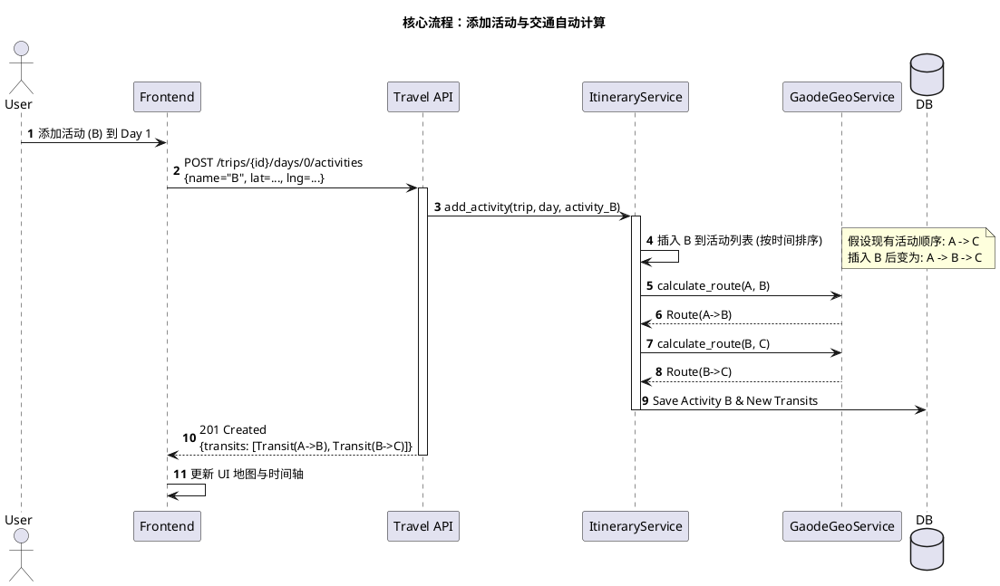
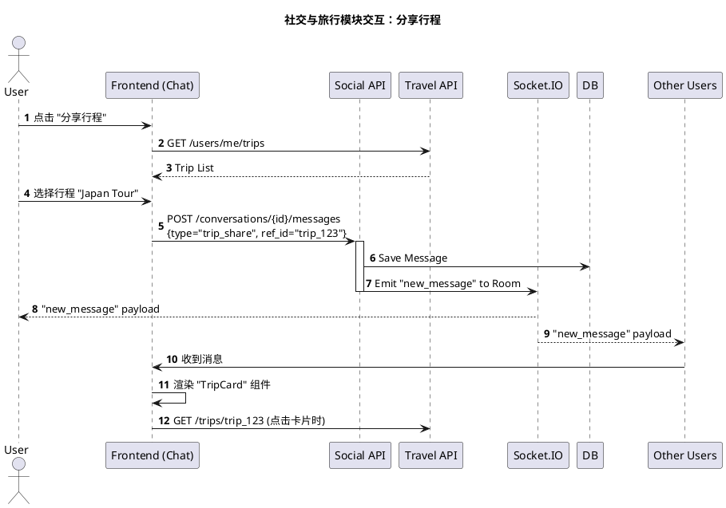
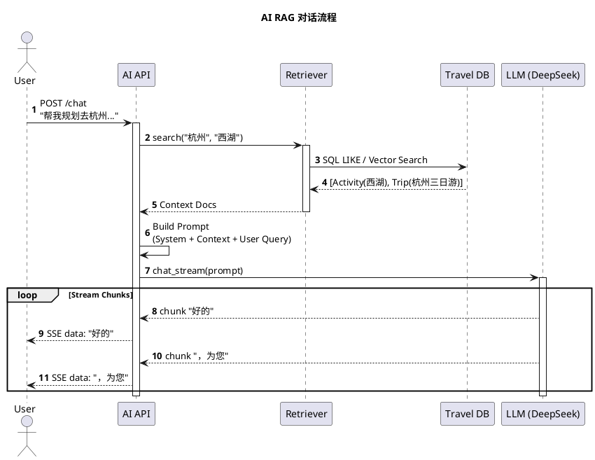

# API 接口详细设计说明书 (API Design Specification)

## 1. 引言

### 1.1 文档目的
本文档详细定义了“旅行信息分享应用”后端提供的 RESTful API 接口规范。该文档作为前后端开发对接、测试及第三方集成的标准参考。所有接口基于 HTTP/1.1 协议，采用 JSON 作为数据交换格式。

### 1.2 设计原则
*   **RESTful 风格**：资源导向的 URL 设计，正确使用 HTTP 动词 (GET, POST, PUT, DELETE)。
*   **统一响应格式**：所有非流式接口返回标准 JSON 结构。
*   **无状态认证**：主要依赖 Session Cookie (开发阶段) 或 JWT (生产阶段建议) 进行身份验证。
*   **版本控制**：接口路径包含版本号（目前隐含为 v1，路径如 `/api/travel/...`）。

---

## 2. 通用规范

### 2.1 基础 URL
*   所有 API 的 Base URL 为：`http://<host>:<port>/api`
*   模块前缀：
    *   认证模块：`/api/auth`
    *   旅行模块：`/api/travel`
    *   社交模块：`/api/social`
    *   AI 模块：`/api/ai`

### 2.2 请求头 (Headers)
*   `Content-Type`: `application/json` (普通请求) 或 `multipart/form-data` (文件上传)
*   `Accept`: `application/json`
*   `Cookie`: `session=<token>` (用于身份认证)

### 2.3 响应格式
**成功响应 (2xx)**
```json
// 返回对象
{
  "id": "uuid...",
  "name": "resource_name",
  ...
}

// 或返回列表
[
  { "id": "1", ... },
  { "id": "2", ... }
]
```

**错误响应 (4xx/5xx)**
```json
{
  "error": "Error message details"
}
```

### 2.4 常用状态码
*   `200 OK`: 请求成功。
*   `201 Created`: 资源创建成功。
*   `204 No Content`: 请求成功但无返回内容（常用于 DELETE）。
*   `400 Bad Request`: 参数错误或业务校验失败。
*   `401 Unauthorized`: 未登录或 Session 过期。
*   `403 Forbidden`: 已登录但无权限执行此操作。
*   `404 Not Found`: 资源不存在。
*   `500 Internal Server Error`: 服务器内部错误。

---

## 3. 认证模块 (Auth Module)

### 3.1 注册
*   **URL**: `POST /api/auth/register`
*   **描述**: 创建新用户账号。
*   **请求体**:
    ```json
    {
      "username": "john_doe",
      "email": "john@example.com",
      "password": "secure_password_123"
    }
    ```
*   **响应 (201)**: 返回完整的用户对象（不含密码）。

### 3.2 登录
*   **URL**: `POST /api/auth/login`
*   **描述**: 验证凭据并建立会话。
*   **请求体**:
    ```json
    {
      "email": "john@example.com",
      "password": "secure_password_123"
    }
    ```
*   **响应 (200)**: 用户对象。Set-Cookie 头包含 session_id。

### 3.3 获取当前用户
*   **URL**: `GET /api/auth/me`
*   **描述**: 根据 Session 获取当前登录用户信息。
*   **响应 (200)**: 用户对象。

### 3.4 更新个人资料
*   **URL**: `PUT /api/auth/me/profile`
*   **Content-Type**: `multipart/form-data` (支持头像上传) 或 `application/json`
*   **请求参数**:
    *   `bio`: 个人简介
    *   `location`: 常驻地
    *   `avatar`: (File) 头像文件
*   **响应 (200)**: 更新后的用户对象。

---

## 4. 旅行模块 (Travel Module)

### 4.1 创建行程
*   **URL**: `POST /api/travel/trips`
*   **描述**: 初始化一个新的旅行计划。
*   **请求体**:
    ```json
    {
      "name": "Japan Spring Tour",
      "description": "Cherry blossom viewing",
      "creator_id": "uuid...",
      "start_date": "2024-04-01",
      "end_date": "2024-04-10",
      "budget_amount": 20000,
      "visibility": "public"
    }
    ```
*   **响应 (201)**: 新创建的 Trip 对象。

### 4.2 获取行程详情
*   **URL**: `GET /api/travel/trips/<trip_id>`
*   **描述**: 获取完整的行程信息，包括日程（Days）、活动（Activities）和成员。
*   **响应 (200)**:
    ```json
    {
      "id": "uuid...",
      "name": "Japan Spring Tour",
      "days": [
        {
          "day_index": 0,
          "date": "2024-04-01",
          "activities": [...],
          "transits": [...]
        }
      ],
      "members": [...]
    }
    ```

### 4.3 添加活动 (智能计算)
*   **URL**: `POST /api/travel/trips/<trip_id>/days/<day_index>/activities`
*   **描述**: 向指定天添加活动。**核心逻辑**：添加后后端会自动调用地图服务计算与前序/后序活动的交通路线。
*   **请求体**:
    ```json
    {
      "name": "Senso-ji Temple",
      "activity_type": "sight",
      "location_name": "Senso-ji",
      "latitude": 35.7147,
      "longitude": 139.7966,
      "start_time": "09:00",
      "end_time": "11:00"
    }
    ```
*   **响应 (201)**: 返回交通计算结果，包含更新后的 Transit 列表。
    ```json
    {
      "transits": [
        {
          "id": "transit_uuid...",
          "from_activity_id": "prev_act_id",
          "to_activity_id": "new_act_id",
          "distance_meters": 1500,
          "duration_seconds": 900,
          "mode": "transit"
        }
      ],
      "warnings": []
    }
    ```

### 4.4 批量更新日程
*   **URL**: `PUT /api/travel/trips/<trip_id>/days/<day_index>/itinerary`
*   **描述**: 前端拖拽排序活动后，调用此接口批量保存顺序，并触发全天交通重算。
*   **请求体**:
    ```json
    {
      "activities": [
        { "id": "act_1", "start_time": "09:00", "end_time": "10:00" },
        { "id": "act_2", "start_time": "10:30", "end_time": "12:00" }
      ]
    }
    ```
*   **响应 (200)**: 更新后的完整交通信息。



---

## 5. 社交模块 (Social Module)

### 5.1 发布帖子
*   **URL**: `POST /api/social/posts`
*   **Content-Type**: `multipart/form-data`
*   **请求参数**:
    *   `title`: 标题
    *   `content`: 正文
    *   `media_files`: (Files) 多张图片
    *   `trip_id`: (Optional) 关联的行程ID
*   **响应 (201)**: 创建的帖子对象。

### 5.2 获取 Feed 流
*   **URL**: `GET /api/social/feed`
*   **参数**:
    *   `limit`: 数量 (默认 20)
    *   `offset`: 偏移量
    *   `tags`: 标签筛选
*   **响应 (200)**: 帖子列表。

### 5.3 发送消息 (私聊/群聊)
*   **URL**: `POST /api/social/conversations/<conv_id>/messages`
*   **请求体**:
    ```json
    {
      "content": "Check out this trip!",
      "type": "trip_share",
      "reference_id": "trip_uuid..."
    }
    ```
*   **响应 (201)**: 消息对象。同时触发 WebSocket 推送。

### 5.4 实时 WebSocket 协议
除了 REST API，系统使用 Socket.IO 进行实时通讯。

*   **Namespace**: `/` (默认)
*   **Events**:
    *   Client -> Server: `join` (room_id)
    *   Server -> Client: `new_message` (message_payload)
    *   Server -> Client: `notification` (type, content)



---

## 6. AI 助手模块 (AI Module)

### 6.1 AI 对话 (流式)
*   **URL**: `POST /api/ai/chat`
*   **描述**: 基于 RAG 技术与 AI 对话，返回流式响应 (SSE)。
*   **请求体**:
    ```json
    {
      "message": "帮我规划去杭州的行程，我想看西湖",
      "conversation_id": "optional_conv_id"
    }
    ```
*   **响应**: `text/event-stream`
    *   数据块格式：`data: {"chunk": "..."}\n\n`
    *   结束标识：流自动结束。

### 6.2 获取 AI 会话历史
*   **URL**: `GET /api/ai/conversations/<conversation_id>`
*   **响应**: 包含历史消息列表（User & Assistant）。



---

## 7. 错误处理与状态码汇总

系统采用统一的错误响应结构。前端应当拦截所有非 2xx 响应并处理 `error` 字段。

| 状态码 | 含义 | 场景示例 |
| :--- | :--- | :--- |
| **400** | Bad Request | 注册时邮箱格式错误；活动时间结束早于开始。 |
| **401** | Unauthorized | 未登录调用需权限接口；Session 过期。 |
| **403** | Forbidden | 尝试删除别人的帖子；尝试编辑非自己创建的行程。 |
| **404** | Not Found | 访问不存在的 Trip ID 或 Post ID。 |
| **429** | Too Many Requests | AI 接口调用频率限制。 |
| **500** | Internal Error | 数据库连接失败；未捕获的代码异常。 |

## 8. 总结
本 API 设计文档覆盖了系统的核心业务场景。通过 RESTful 接口提供资源的增删改查，通过 WebSocket 提供实时互动，通过 SSE 提供流畅的 AI 体验。接口设计遵循高内聚低耦合原则，各模块（Auth, Travel, Social, AI）边界清晰，便于独立开发与维护。
