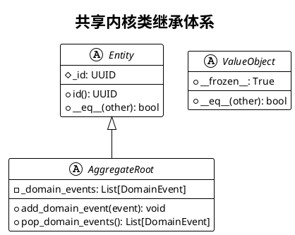
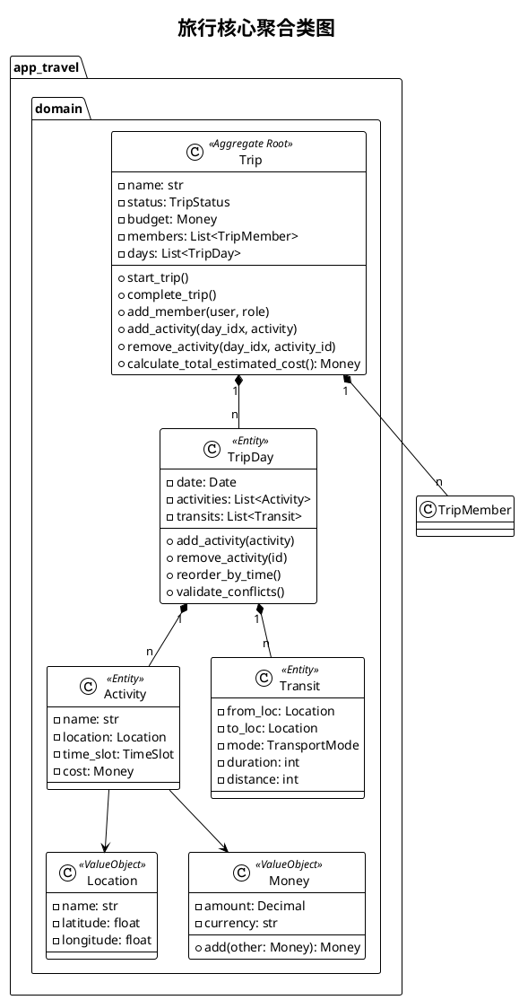
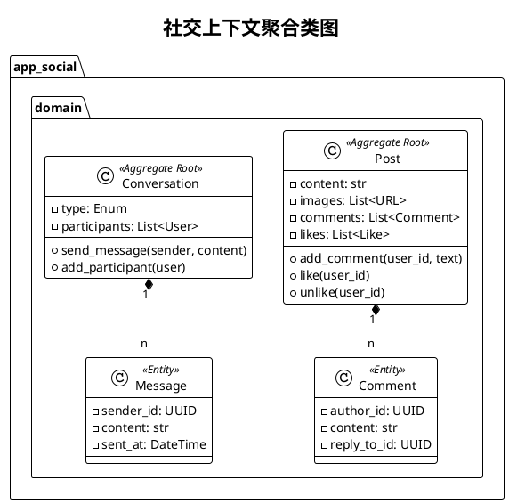
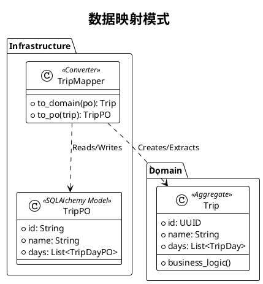

# 详细类设计说明书 (Detailed Class Design Specification)

## 1. 引言

### 1.1 文档目的
本文档旨在详细描述“旅行信息分享应用”后端系统的类级设计。基于领域驱动设计（DDD）原则，本文档将深入剖析核心业务逻辑的面向对象实现，包括聚合根、实体、值对象、领域服务、应用服务、基础设施实现以及它们之间的交互关系。此文档作为开发人员编码、单元测试及代码走查的直接依据。

### 1.2 适用范围
本文档涵盖后端 Python Flask 应用的所有子模块：
- **Shared Kernel**：共享内核与基础架构类。
- **App Auth**：用户认证上下文。
- **App Travel**：旅行核心上下文。
- **App Social**：社交互动上下文。
- **App AI**：人工智能助手上下文。

### 1.3 设计原则
1.  **单一职责原则 (SRP)**：每个类仅负责一个功能领域。
2.  **依赖倒置原则 (DIP)**：高层模块（领域层）不依赖低层模块（基础设施层），二者都依赖抽象（接口）。
3.  **充血模型 (Rich Domain Model)**：业务逻辑封装在领域实体中，而非泄露到服务层。
4.  **显式架构**：通过包结构和类命名明确区分 Layer（层）和 Bounded Context（限界上下文）。

---

## 2. 共享内核设计 (Shared Kernel)

共享内核位于 `src/shared/` 目录下，定义了整个系统通用的基类、接口和工具，是维持架构一致性的基石。

### 2.1 领域基础类

#### 2.1.1 `Entity` (抽象基类)
所有拥有唯一标识符（Identity）的领域对象的基类。
*   **属性**：
    *   `_id`: `UUID` - 实体的全局唯一标识。
*   **方法**：
    *   `__eq__(other)`: 基于 `id` 判断两个实体是否相等，而非基于内存地址。
    *   `__hash__()`: 基于 `id` 生成哈希值，允许实体作为集合成员。
*   **设计意图**：确保在内存中不同的对象实例，只要 ID 相同，即被视为同一个业务实体。

#### 2.1.2 `AggregateRoot` (抽象基类)
继承自 `Entity`，表示聚合根。它是修改数据的唯一入口，负责维护聚合内部的一致性。
*   **属性**：
    *   `_domain_events`: `List[DomainEvent]` - 暂存该聚合产生的领域事件。
*   **方法**：
    *   `add_domain_event(event: DomainEvent)`: 注册一个发生在该聚合上的事件。
    *   `pop_domain_events() -> List[DomainEvent]`: 获取并清空所有待发布的事件（通常在事务提交前调用）。
    *   `check_rule(rule: BusinessRule)`: 用于执行复杂的跨字段业务规则校验。

#### 2.1.3 `ValueObject` (抽象基类)
表示没有唯一标识、由属性值定义的对象（如坐标、金额）。
*   **特性**：不可变（Immutable）。一旦创建，属性不可修改。
*   **方法**：
    *   `__eq__`: 比较所有属性值是否相等。

### 2.2 事件总线机制

#### 2.2.1 `DomainEvent` (数据类)
所有领域事件的基类，承载发生的事实数据。
*   **属性**：
    *   `event_id`: `UUID` - 事件本身的一一标识。
    *   `occurred_on`: `DateTime` - 事件发生时间。
    *   `event_name`: `str` - 事件名称（如 "TripCreated"）。

#### 2.2.2 `EventBus` (单例模式)
负责解耦事件发布者和订阅者。
*   **属性**：
    *   `_subscribers`: `Dict[str, List[Callable]]` - 存储事件名到处理函数的映射。
*   **方法**：
    *   `subscribe(event_name: str, handler: Callable)`: 注册监听器。
    *   `publish(event: DomainEvent)`: 同步或异步调用所有对应的监听器。
*   **设计模式**：观察者模式 (Observer Pattern)。

---

## 3. 旅行上下文类设计 (App Travel)

这是系统的核心复杂域，物理路径 `src/app_travel`。

### 3.1 领域层 (Domain Layer)

#### 3.1.1 `Trip` (聚合根)
代表一次旅行计划，是整个上下文的核心控制点。
*   **属性**：
    *   `name`: `str`
    *   `status`: `TripStatus` (Enum: PLANNING, ONGOING, COMPLETED, CANCELLED)
    *   `budget`: `Money` (Value Object)
    *   `dates`: `DateRange` (Value Object)
    *   `_days`: `List[TripDay]` (聚合内部实体列表)
    *   `_members`: `List[TripMember]`
*   **核心业务方法**：
    *   `create(owner_id: UUID, name: str, ...) -> Trip`: 静态工厂方法，初始化新行程并触发 `TripCreatedEvent`。
    *   `add_member(user_id: UUID, role: MemberRole)`:
        *   *逻辑*：检查操作者权限 -> 检查用户是否已存在 -> 检查行程状态（已结束不可加人）-> 创建 `TripMember` 实体 -> 添加到列表 -> 触发 `TripMemberAddedEvent`。
    *   `start_trip()`:
        *   *逻辑*：校验当前时间是否到达 `start_date` -> 校验状态必须为 `PLANNING` -> 修改状态为 `ONGOING` -> 触发 `TripStartedEvent`。
    *   `add_activity(day_index: int, activity: Activity)`:
        *   *逻辑*：获取指定索引的 `TripDay` -> 调用 `TripDay.add_activity()` -> 更新聚合根的 `updated_at`。
    *   `calculate_total_cost() -> Money`:
        *   *逻辑*：遍历所有 `_days`，累加所有活动和交通的费用。

#### 3.1.2 `TripDay` (实体)
代表行程中的某一天。
*   **属性**：
    *   `trip_id`: `UUID`
    *   `day_number`: `int` (第几天)
    *   `date`: `Date`
    *   `_activities`: `List[Activity]`
    *   `_transits`: `List[Transit]`
*   **方法**：
    *   `add_activity(activity: Activity)`: 将活动加入列表，并根据 `start_time` 自动重排序 (Sort)。
    *   `check_time_conflict(new_activity: Activity)`: 遍历现有活动，检查时间段是否存在重叠。若重叠抛出 `TimeConflictException`。

#### 3.1.3 `Activity` (实体)
具体的游玩项目。
*   **属性**：
    *   `location`: `Location` (包含 name, lat, lng, address)
    *   `time_slot`: `TimeSlot` (start, end)
    *   `cost`: `Money`
    *   `notes`: `str`

#### 3.1.4 `ItineraryService` (领域服务)
处理跨实体的复杂逻辑，特别是涉及外部计算的逻辑。
*   **方法**：
    *   `optimize_route(day: TripDay) -> TripDay`:
        *   *职责*：调用外部地图服务接口，计算当天所有活动点之间的最佳路径，生成或更新 `Transit` 对象列表，填充交通方式和耗时。注意，领域服务定义接口，具体实现由 Infrastructure 提供。

### 3.2 应用层 (Application Layer)

#### 3.2.1 `TravelService`
编排旅行相关的用户用例。
*   **依赖**：`ITripRepository`, `IUserRepository`, `EventBus`, `IGeoService`。
*   **方法**：
    *   `create_trip(cmd: CreateTripCommand) -> TripDTO`:
        *   1. 开启数据库事务。
        *   2. 调用 `Trip.create(...)` 工厂方法创建聚合根。
        *   3. 调用 `trip_repository.save(trip)`。
        *   4. `trip.pop_domain_events()` 并通过 `event_bus` 发布。
        *   5. 提交事务。
        *   6. 返回 DTO。
    *   `add_activity_to_day(cmd: AddActivityCommand)`:
        *   1. `trip = trip_repo.find_by_id(cmd.trip_id)`。
        *   2. 构造 `Activity` 实体（值对象转换）。
        *   3. `trip.add_activity(cmd.day_index, activity)`。
        *   4. *可选*：调用 `itinerary_service.calculate_transits(trip.days[cmd.day_index])` 自动补充交通信息。
        *   5. `trip_repo.save(trip)`。

### 3.3 基础设施层 (Infrastructure Layer)

#### 3.3.1 `TripRepositoryImpl`
实现 `ITripRepository` 接口。
*   **职责**：负责 Domain Object (DO) 与 Persistent Object (PO) 之间的转换与持久化。
*   **核心类**：
    *   `TripPO` (SQLAlchemy Model): 对应 `trips` 表。
    *   `TripDayPO`: 对应 `trip_days` 表。
    *   `ActivityPO`: 对应 `activities` 表。
    *   `TripMapper`: 静态工具类，包含 `to_domain(po) -> Trip` 和 `to_po(entity) -> TripPO` 方法。
*   **难点实现**：
    *   `save(trip: Trip)`: 并非简单的 insert。需要比较领域对象中的 `days` 列表与数据库现存记录的差异（Diff），识别出新增的 Activity、删除的 Activity 和修改的 Activity，并在一个事务中执行相应的 SQL 操作。

#### 3.3.2 `GaodeGeoServiceImpl`
实现 `IGeoService` 接口，对接高德地图 Web 服务 API。
*   **方法**：
    *   `calculate_route(origin, dest, mode)`: 发送 HTTP GET 请求到高德 API，解析 JSON 响应，返回距离（米）和耗时（秒）。需处理网络超时和 API 错误码。

---

## 4. 社交上下文类设计 (App Social)

### 4.1 领域层 (Domain Layer)

#### 4.1.1 `Post` (聚合根)
代表用户发布的游记或动态。
*   **属性**：
    *   `author_id`: `UUID`
    *   `content`: `str`
    *   `images`: `List[str]` (URL 列表)
    *   `linked_trip_id`: `UUID` (可选)
    *   `_likes`: `List[Like]` (引用对象或计数，视性能需求而定，这里设计为实体列表)
    *   `_comments`: `List[Comment]`
*   **方法**：
    *   `publish(author, content, ...)`: 工厂方法。
    *   `add_comment(author_id, text, parent_id=None)`: 添加评论，支持楼中楼。
    *   `toggle_like(user_id)`: 如果已点赞则取消，未点赞则添加。

#### 4.1.2 `Conversation` (聚合根)
代表私聊或群聊会话。
*   **属性**：
    *   `type`: `ConversationType` (PRIVATE, GROUP)
    *   `participants`: `List[Participant]`
    *   `messages`: `List[Message]` (通常只加载最近的 N 条，不全量加载)
*   **方法**：
    *   `post_message(sender_id, content)`:
        *   创建 `Message` 实体。
        *   更新 `last_message_at` 时间戳。
        *   触发 `MessageSentEvent`（用于 WebSocket 推送）。
    *   `mark_read(user_id, message_id)`: 更新已读状态。

### 4.2 应用层与基础设施层

#### 4.2.1 `SocialService`
*   **方法**：
    *   `get_feed(user_id, page, size)`:
        *   *注意*：这里不建议通过 Repository 加载大量 `Post` 聚合根，因为会导致 N+1 查询问题。
        *   *设计*：调用 `PostDAO.query_feed_dto(...)`。这是一个专门的查询服务，直接执行优化的 SQL JOIN 查询，返回扁平化的 DTO 数据（包含是否已点赞、作者信息等），绕过领域模型构建过程（CQRS 读写分离思想）。

#### 4.2.2 `SocketIONotificationHandler`
*   **职责**：监听领域事件并通过 WebSocket 推送给前端。
*   **方法**：
    *   `handle_message_sent(event: MessageSentEvent)`:
        *   解析事件数据。
        *   调用 `socketio.emit('new_message', data, room=conversation_id)`。
        *   确保消息只发送给在线的相关用户。

---

## 5. 认证上下文类设计 (App Auth)

### 5.1 `User` (聚合根)
*   **属性**：
    *   `username`: `str`
    *   `email`: `Email` (Value Object，含格式校验)
    *   `password_hash`: `str` (注意：不存储明文密码)
    *   `profile`: `UserProfile` (Value Object: avatar, bio)
*   **方法**：
    *   `register(username, email, password)`: 工厂方法。内部调用 `PasswordEncoder` 生成哈希。
    *   `change_password(old_pw, new_pw)`: 校验旧密码 -> 生成新哈希。
    *   `verify_password(plain_password) -> bool`: 调用基础设施层的校验逻辑。

### 5.2 `AuthService` (应用服务)
*   **方法**：
    *   `login(email, password) -> TokenDTO`:
        *   调用 `user_repo.find_by_email(email)`。
        *   调用 `user.verify_password(password)`。
        *   如果成功，调用 `TokenProvider.generate_access_token(user)` 生成 JWT。
        *   返回 Token。

---

## 6. AI 助手上下文类设计 (App AI)

### 6.1 `AiConversation` (聚合根)
维护用户与 AI 的上下文历史。
*   **属性**：
    *   `history`: `List[AiMessage]`
*   **方法**：
    *   `ask(user_query: str)`:
        *   记录 User Message。
        *   触发 `AiQueryReceivedEvent`（可能用于异步处理）。

### 6.2 `AiChatDomainService` (核心逻辑)
实现 RAG (Retrieval-Augmented Generation) 流程。
*   **依赖**：`VectorStore` (接口), `LLMClient` (接口)。
*   **方法**：
    *   `stream_response(conversation: AiConversation, query: str)`:
        *   1. **Retrieve**: 调用 `vector_store.search(query)` 获取相关的 `Trip` 或 `Post` 片段。
        *   2. **Augment**: 构建 Prompt = System Prompt + Context + User Query。
        *   3. **Generate**: 调用 `llm_client.chat_stream(prompt)`。
        *   4. 返回生成器，并在生成结束后将完整的 AI 回答追加到 `conversation` 历史中并保存。

### 6.3 基础设施适配器

#### 6.3.1 `DeepSeekAdapter`
实现 `LLMClient` 接口。
*   **职责**：封装对 DeepSeek API 的 HTTP 调用。配置 API Key、Temperature 等参数。处理流式响应 (SSE) 的解析。

#### 6.3.2 `MySQLVectorRetriever` (简易 RAG 实现)
在没有专用向量库的情况下，利用 MySQL 的 `LIKE` 或全文索引实现 `VectorStore` 接口。
*   **逻辑**：
    *   对 `trips` 表的 `name`, `description` 字段进行关键词匹配。
    *   对 `activities` 表的 `location_name` 进行匹配。
    *   将匹配到的记录格式化为文本段落返回。

---

## 7. 数据库映射策略 (ORM Strategy)

本项目使用 SQLAlchemy 作为 ORM 框架，但严格遵循“存储与领域分离”的原则。

### 7.1 持久化对象 (PO)
位于 `infrastructure/models.py`。这些类继承自 `db.Model`，直接映射数据库表。
*   **特点**：
    *   只有数据字段，没有业务方法。
    *   使用 `Column`, `ForeignKey`, `relationship` 定义表结构。
    *   例如：`TripPO` 包含 `id`, `creator_id` 等列，以及 `days = relationship('TripDayPO')`。

### 7.2 映射器 (Mapper)
每个模块都有 `Mapper` 类，负责 PO 和 DO 的互转。
*   **`to_domain(po) -> entity`**:
    *   从 PO 读取数据。
    *   如果是聚合根，需递归转换子 PO（如将 `TripDayPO` 列表转为 `TripDay` 实体列表）。
    *   使用实体的构造函数或 `__dict__` 注入恢复状态（注意：重建对象时不应触发领域事件）。
*   **`to_po(entity) -> po`**:
    *   将实体的属性提取到 PO 中。
    *   对于子实体列表，需要处理 ID 匹配，以确定是更新现有行还是插入新行。

---

## 8. 异常处理设计

系统定义了分层的异常体系：

1.  **`AppException` (基类)**: 所有自定义异常的父类。包含 `code` (错误码) 和 `message` (用户提示)。
2.  **`DomainException` (领域层)**:
    *   `BusinessRuleViolationException`: 违反业务规则（如“预算不能为负”）。
    *   `EntityNotFoundException`: 找不到实体。
    *   `StateConflictException`: 状态冲突（如“已取消的行程不能开始”）。
3.  **`InfraException` (基础设施层)**:
    *   `DatabaseConnectionError`
    *   `ExternalServiceTimeout` (如高德 API 超时)
4.  **`AuthException`**:
    *   `InvalidCredentialsException`
    *   `UnauthorizedAccessException`

**应用层处理策略**：
应用服务层捕获所有 `DomainException`，无需转换为 HTTP 响应，而是直接抛出。最外层的 `GlobalExceptionHandler`（在 Interface 层）负责捕获这些异常，并将其转换为标准的 JSON 错误响应（HTTP 400/404/500）。

---

## 9. 总结

本详细类设计文档展示了如何在一个 Python Flask 项目中落地标准的 DDD 架构。
- 通过 **Shared Kernel** 统一了实体和事件的行为。
- **App Travel** 展示了复杂的聚合根与实体协作。
- **App Social** 展示了 CQRS 的读写分离雏形。
- **App AI** 展示了如何将现代 LLM 能力封装为领域服务。
- **Mapper 模式** 确保了领域模型的纯净性，使其不受 ORM 框架侵入。

该设计能够支撑项目从原型阶段平滑过渡到生产阶段，具备良好的可测试性和可维护性。