# 数据库详细设计说明书 (Database Design Specification)

## 1. 引言

### 1.1 文档目的
本文档旨在详细描述“旅行信息分享应用”的后端数据库设计。基于系统需求分析与领域模型设计，本文档定义了数据库的表结构、字段属性、索引策略及表间关系，为后续的数据库构建、数据迁移及后端开发提供准确的参考依据。

### 1.2 设计原则
1.  **标准化 (Normalization)**：原则上遵循第三范式 (3NF)，以减少数据冗余和保证数据一致性。在特定场景（如 Feed 流查询）下，允许适当的反范式化设计（如 JSON 字段存储）以优化读取性能。
2.  **完整性 (Integrity)**：充分利用外键约束 (Foreign Keys)、唯一约束 (Unique Constraints) 和非空约束 (Not Null) 保证数据的引用完整性和业务规则。
3.  **可扩展性 (Scalability)**：主键尽可能使用 UUID（字符串类型），方便未来进行水平分库分表。对于局部聚合的子实体（如图片列表、标签），使用关联表或 JSON 存储。
4.  **命名规范**：
    *   表名：全小写，下划线分隔，复数形式 (e.g., `users`, `trip_days`)。
    *   字段名：全小写，下划线分隔 (e.g., `created_at`, `user_id`)。
    *   索引名：`idx_<table_name>_<column_name>`。
    *   外键名：`fk_<table_name>_<column_name>`。

### 1.3 技术选型
*   **数据库管理系统**：MySQL 8.0+
*   **字符集**：`utf8mb4` (支持 Emoji)
*   **排序规则**：`utf8mb4_unicode_ci`
*   **时区**：UTC (应用层处理时区转换)

---

## 2. 总体 E-R 图 (Entity-Relationship Diagram)

```plantuml
@startuml
!theme plain
hide circle
skinparam linetype ortho

' --- Auth Context ---
entity "users" as user {
  *id : VARCHAR(36) <<PK>>
  --
  *username : VARCHAR(50) <<UQ>>
  *email : VARCHAR(255) <<UQ>>
  *hashed_password : VARCHAR(255)
  *role : VARCHAR(20)
  avatar_url : VARCHAR(500)
  bio : TEXT
  location : VARCHAR(100)
  *is_active : BOOLEAN
  *is_email_verified : BOOLEAN
  *created_at : DATETIME
  *updated_at : DATETIME
}

' --- Travel Context ---
entity "trips" as trip {
  *id : VARCHAR(36) <<PK>>
  --
  *creator_id : VARCHAR(36) <<FK>>
  *name : VARCHAR(100)
  description : TEXT
  *start_date : DATE
  *end_date : DATE
  budget_amount : DECIMAL(10,2)
  budget_currency : VARCHAR(3)
  *visibility : VARCHAR(20)
  *status : VARCHAR(20)
  cover_image_url : VARCHAR(500)
  *created_at : DATETIME
  *updated_at : DATETIME
}

entity "trip_members" as trip_member {
  *id : INT <<PK, AI>>
  --
  *trip_id : VARCHAR(36) <<FK>>
  *user_id : VARCHAR(36) <<FK>>
  *role : VARCHAR(20)
  nickname : VARCHAR(50)
  *joined_at : DATETIME
}

entity "trip_days" as trip_day {
  *id : INT <<PK, AI>>
  --
  *trip_id : VARCHAR(36) <<FK>>
  *day_number : INT
  *date : DATE
  theme : VARCHAR(100)
  notes : TEXT
}

entity "activities" as activity {
  *id : VARCHAR(36) <<PK>>
  --
  *trip_day_id : INT <<FK>>
  *name : VARCHAR(200)
  *activity_type : VARCHAR(30)
  *location_name : VARCHAR(200)
  location_latitude : DECIMAL(10,7)
  location_longitude : DECIMAL(10,7)
  location_address : VARCHAR(500)
  *start_time : TIME
  *end_time : TIME
  cost_amount : DECIMAL(10,2)
  cost_currency : VARCHAR(3)
  notes : TEXT
  booking_reference : VARCHAR(100)
}

entity "transits" as transit {
  *id : VARCHAR(36) <<PK>>
  --
  *trip_day_id : INT <<FK>>
  *from_activity_id : VARCHAR(36)
  *to_activity_id : VARCHAR(36)
  *transport_mode : VARCHAR(20)
  distance_meters : DECIMAL(12,2)
  duration_seconds : INT
  polyline : TEXT
  *departure_time : TIME
  *arrival_time : TIME
  cost_amount : DECIMAL(10,2)
  fuel_cost : DECIMAL(10,2)
  toll_cost : DECIMAL(10,2)
  ticket_cost : DECIMAL(10,2)
  notes : TEXT
}

' --- Social Context ---
entity "posts" as post {
  *id : VARCHAR(36) <<PK>>
  --
  *author_id : VARCHAR(36) <<FK>>
  trip_id : VARCHAR(36) <<FK>>
  *title : VARCHAR(200)
  *text : TEXT
  images_json : TEXT
  tags_json : TEXT
  *visibility : VARCHAR(20)
  *is_deleted : BOOLEAN
  *created_at : DATETIME
  *updated_at : DATETIME
}

entity "post_images" as post_image {
  *id : INT <<PK, AI>>
  --
  *post_id : VARCHAR(36) <<FK>>
  *image_url : VARCHAR(500)
  *display_order : INT
}

entity "post_tags" as post_tag {
  *id : INT <<PK, AI>>
  --
  *post_id : VARCHAR(36) <<FK>>
  *tag : VARCHAR(50)
}

entity "comments" as comment {
  *id : VARCHAR(36) <<PK>>
  --
  *post_id : VARCHAR(36) <<FK>>
  *author_id : VARCHAR(36) <<FK>>
  parent_id : VARCHAR(36)
  *content : TEXT
  *created_at : DATETIME
  *is_deleted : BOOLEAN
}

entity "likes" as like {
  *id : INT <<PK, AI>>
  --
  *user_id : VARCHAR(36) <<FK>>
  *post_id : VARCHAR(36) <<FK>>
  *created_at : DATETIME
}

entity "conversations" as conv {
  *id : VARCHAR(36) <<PK>>
  --
  *conversation_type : VARCHAR(20)
  title : VARCHAR(100)
  *created_at : DATETIME
  last_message_at : DATETIME
}

entity "conversation_participants" as conv_part {
  *conversation_id : VARCHAR(36) <<PK, FK>>
  *user_id : VARCHAR(36) <<PK, FK>>
  --
  *role : VARCHAR(20)
}

entity "messages" as msg {
  *id : VARCHAR(36) <<PK>>
  --
  *conversation_id : VARCHAR(36) <<FK>>
  *sender_id : VARCHAR(36) <<FK>>
  *content_text : TEXT
  *message_type : VARCHAR(20)
  media_url : VARCHAR(500)
  reference_id : VARCHAR(36)
  *sent_at : DATETIME
  *is_deleted : BOOLEAN
  read_by_json : TEXT
}

entity "friendships" as friend {
  *id : VARCHAR(36) <<PK>>
  --
  *requester_id : VARCHAR(36) <<FK>>
  *addressee_id : VARCHAR(36) <<FK>>
  *status : ENUM
  *created_at : DATETIME
  *updated_at : DATETIME
}

' --- AI Context ---
entity "ai_conversations" as ai_conv {
  *id : VARCHAR(36) <<PK>>
  --
  *user_id : VARCHAR(36) <<FK>>
  title : VARCHAR(100)
  *created_at : DATETIME
  *updated_at : DATETIME
  *is_deleted : BOOLEAN
}

entity "ai_messages" as ai_msg {
  *id : INT <<PK, AI>>
  --
  *conversation_id : VARCHAR(36) <<FK>>
  *role : VARCHAR(20)
  *content : TEXT
  attachments_json : TEXT
  *created_at : DATETIME
}

' Relationships
trip_member }o..|| user
trip_member }o..|| trip
trip_day }o..|| trip
activity }o..|| trip_day
transit }o..|| trip_day

post }o..|| user
post }o..|| trip
post_image }o..|| post
post_tag }o..|| post
comment }o..|| post
comment }o..|| user
like }o..|| post
like }o..|| user

conv_part }o..|| conv
conv_part }o..|| user
msg }o..|| conv
msg }o..|| user

friend }o..|| user : requester
friend }o..|| user : addressee

ai_conv }o..|| user
ai_msg }o..|| ai_conv

@enduml
```



---

## 3. 详细表设计 (Table Definitions)

### 3.1 用户认证模块 (`app_auth`)

#### 3.1.1 用户表 (`users`)
存储系统的核心用户信息。

| 字段名 | 类型 | 长度 | 允许空 | 默认值 | 描述 |
| :--- | :--- | :--- | :--- | :--- | :--- |
| **id** | VARCHAR | 36 | NO | - | 主键，UUID |
| username | VARCHAR | 50 | NO | - | 用户名，唯一 |
| email | VARCHAR | 255 | NO | - | 邮箱地址，唯一 |
| hashed_password | VARCHAR | 255 | NO | - | bcrypt加密后的密码 |
| role | VARCHAR | 20 | NO | 'user' | 角色：admin, user |
| avatar_url | VARCHAR | 500 | YES | - | 头像URL |
| bio | TEXT | - | YES | - | 个人简介 |
| location | VARCHAR | 100 | YES | - | 常驻地 |
| is_active | BOOLEAN | - | NO | TRUE | 账号是否启用 |
| is_email_verified | BOOLEAN | - | NO | FALSE | 邮箱是否验证 |
| created_at | DATETIME | - | NO | NOW | 注册时间 |
| updated_at | DATETIME | - | NO | NOW | 更新时间 |

*   **索引**：
    *   `idx_users_username` (unique)
    *   `idx_users_email` (unique)

---

### 3.2 旅行核心模块 (`app_travel`)

#### 3.2.1 行程表 (`trips`)
行程聚合根，记录一次旅行的全局信息。

| 字段名 | 类型 | 长度 | 允许空 | 默认值 | 描述 |
| :--- | :--- | :--- | :--- | :--- | :--- |
| **id** | VARCHAR | 36 | NO | - | 主键，UUID |
| creator_id | VARCHAR | 36 | NO | - | 创建者ID |
| name | VARCHAR | 100 | NO | - | 行程名称 |
| description | TEXT | - | YES | - | 行程描述 |
| start_date | DATE | - | NO | - | 开始日期 |
| end_date | DATE | - | NO | - | 结束日期 |
| budget_amount | DECIMAL | 10,2 | YES | - | 预算总额 |
| budget_currency | VARCHAR | 3 | YES | 'CNY' | 货币代码 |
| visibility | VARCHAR | 20 | NO | 'private' | private, public, friends_only |
| status | VARCHAR | 20 | NO | 'planning' | planning, ongoing, completed, cancelled |
| cover_image_url | VARCHAR | 500 | YES | - | 封面图 |
| created_at | DATETIME | - | NO | NOW | 创建时间 |
| updated_at | DATETIME | - | NO | NOW | 更新时间 |

*   **索引**：
    *   `idx_trips_creator_id`

#### 3.2.2 行程成员表 (`trip_members`)
记录参与行程的用户及其角色。

| 字段名 | 类型 | 长度 | 允许空 | 默认值 | 描述 |
| :--- | :--- | :--- | :--- | :--- | :--- |
| **id** | INT | - | NO | AI | 主键，自增 |
| trip_id | VARCHAR | 36 | NO | - | 外键 -> trips.id |
| user_id | VARCHAR | 36 | NO | - | 外键 -> users.id |
| role | VARCHAR | 20 | NO | 'member' | owner, admin, member, viewer |
| nickname | VARCHAR | 50 | YES | - | 行程内昵称 |
| joined_at | DATETIME | - | NO | NOW | 加入时间 |

*   **索引**：
    *   `idx_trip_members_trip_id`
    *   `idx_trip_members_user_id`

#### 3.2.3 日程表 (`trip_days`)
行程的具体某一天。

| 字段名 | 类型 | 长度 | 允许空 | 默认值 | 描述 |
| :--- | :--- | :--- | :--- | :--- | :--- |
| **id** | INT | - | NO | AI | 主键，自增 |
| trip_id | VARCHAR | 36 | NO | - | 外键 -> trips.id |
| day_number | INT | - | NO | - | 第几天 (1, 2, 3...) |
| date | DATE | - | NO | - | 具体日期 |
| theme | VARCHAR | 100 | YES | - | 当日主题 |
| notes | TEXT | - | YES | - | 当日备注 |

*   **索引**：
    *   `idx_trip_days_trip_id`

#### 3.2.4 活动表 (`activities`)
某一天内的具体活动点。

| 字段名 | 类型 | 长度 | 允许空 | 默认值 | 描述 |
| :--- | :--- | :--- | :--- | :--- | :--- |
| **id** | VARCHAR | 36 | NO | - | 主键，UUID |
| trip_day_id | INT | - | NO | - | 外键 -> trip_days.id |
| name | VARCHAR | 200 | NO | - | 活动名称 |
| activity_type | VARCHAR | 30 | NO | - | sight, food, hotel, transport... |
| location_name | VARCHAR | 200 | NO | - | 地点名称 |
| location_latitude | DECIMAL | 10,7 | YES | - | 纬度 |
| location_longitude | DECIMAL | 10,7 | YES | - | 经度 |
| location_address | VARCHAR | 500 | YES | - | 详细地址 |
| start_time | TIME | - | NO | - | 开始时间 |
| end_time | TIME | - | NO | - | 结束时间 |
| cost_amount | DECIMAL | 10,2 | YES | - | 费用 |
| cost_currency | VARCHAR | 3 | YES | 'CNY' | 货币 |
| notes | TEXT | - | YES | - | 备注 |
| booking_reference | VARCHAR | 100 | YES | - | 预订号 |

*   **索引**：
    *   `idx_activities_trip_day_id`

#### 3.2.5 交通表 (`transits`)
连接两个活动点的交通信息。

| 字段名 | 类型 | 长度 | 允许空 | 默认值 | 描述 |
| :--- | :--- | :--- | :--- | :--- | :--- |
| **id** | VARCHAR | 36 | NO | - | 主键，UUID |
| trip_day_id | INT | - | NO | - | 外键 -> trip_days.id |
| from_activity_id | VARCHAR | 36 | NO | - | 起点活动ID |
| to_activity_id | VARCHAR | 36 | NO | - | 终点活动ID |
| transport_mode | VARCHAR | 20 | NO | - | driving, walking, transit... |
| distance_meters | DECIMAL | 12,2 | NO | 0 | 距离(米) |
| duration_seconds | INT | - | NO | 0 | 耗时(秒) |
| polyline | TEXT | - | YES | - | 路径编码 |
| departure_time | TIME | - | NO | - | 出发时间 |
| arrival_time | TIME | - | NO | - | 到达时间 |
| cost_amount | DECIMAL | 10,2 | YES | - | 总估算费用 |
| fuel_cost | DECIMAL | 10,2 | YES | - | 油费 |
| toll_cost | DECIMAL | 10,2 | YES | - | 过路费 |
| ticket_cost | DECIMAL | 10,2 | YES | - | 票价 |
| notes | TEXT | - | YES | - | 备注 |

*   **索引**：
    *   `idx_transits_trip_day_id`

---

### 3.3 社交互动模块 (`app_social`)

#### 3.3.1 帖子表 (`posts`)
社区游记与动态。

| 字段名 | 类型 | 长度 | 允许空 | 默认值 | 描述 |
| :--- | :--- | :--- | :--- | :--- | :--- |
| **id** | VARCHAR | 36 | NO | - | 主键，UUID |
| author_id | VARCHAR | 36 | NO | - | 外键 -> users.id |
| trip_id | VARCHAR | 36 | YES | - | 关联行程ID |
| title | VARCHAR | 200 | NO | - | 标题 |
| text | TEXT | - | NO | - | 正文内容 |
| images_json | TEXT | - | YES | - | 图片URL列表 (冗余存储) |
| tags_json | TEXT | - | YES | - | 标签列表 (冗余存储) |
| visibility | VARCHAR | 20 | NO | 'public' | 可见性 |
| is_deleted | BOOLEAN | - | NO | FALSE | 软删除 |
| created_at | DATETIME | - | NO | NOW | 发布时间 |
| updated_at | DATETIME | - | NO | NOW | 更新时间 |

*   **索引**：
    *   `idx_posts_author_id`
    *   `idx_posts_trip_id`

#### 3.3.2 帖子图片表 (`post_images`)
标准化存储图片信息，支持排序。

| 字段名 | 类型 | 长度 | 允许空 | 默认值 | 描述 |
| :--- | :--- | :--- | :--- | :--- | :--- |
| **id** | INT | - | NO | AI | 主键，自增 |
| post_id | VARCHAR | 36 | NO | - | 外键 -> posts.id |
| image_url | VARCHAR | 500 | NO | - | 图片地址 |
| display_order | INT | - | NO | 0 | 展示顺序 |

#### 3.3.3 评论表 (`comments`)
支持楼中楼回复。

| 字段名 | 类型 | 长度 | 允许空 | 默认值 | 描述 |
| :--- | :--- | :--- | :--- | :--- | :--- |
| **id** | VARCHAR | 36 | NO | - | 主键，UUID |
| post_id | VARCHAR | 36 | NO | - | 外键 -> posts.id |
| author_id | VARCHAR | 36 | NO | - | 外键 -> users.id |
| parent_id | VARCHAR | 36 | YES | - | 父评论ID |
| content | TEXT | - | NO | - | 评论内容 |
| created_at | DATETIME | - | NO | NOW | 评论时间 |
| is_deleted | BOOLEAN | - | NO | FALSE | 软删除 |

*   **索引**：
    *   `idx_comments_post_id`
    *   `idx_comments_author_id`

#### 3.3.4 点赞表 (`likes`)

| 字段名 | 类型 | 长度 | 允许空 | 默认值 | 描述 |
| :--- | :--- | :--- | :--- | :--- | :--- |
| **id** | INT | - | NO | AI | 主键，自增 |
| user_id | VARCHAR | 36 | NO | - | 外键 -> users.id |
| post_id | VARCHAR | 36 | NO | - | 外键 -> posts.id |
| created_at | DATETIME | - | NO | NOW | 点赞时间 |

*   **索引**：
    *   `idx_likes_post_id`
    *   `idx_likes_user_id`

#### 3.3.5 好友关系表 (`friendships`)

| 字段名 | 类型 | 长度 | 允许空 | 默认值 | 描述 |
| :--- | :--- | :--- | :--- | :--- | :--- |
| **id** | VARCHAR | 36 | NO | - | 主键，UUID |
| requester_id | VARCHAR | 36 | NO | - | 申请人ID |
| addressee_id | VARCHAR | 36 | NO | - | 接收人ID |
| status | VARCHAR | 20 | NO | 'PENDING' | PENDING, ACCEPTED, REJECTED, BLOCKED |
| created_at | DATETIME | - | NO | NOW | 创建时间 |
| updated_at | DATETIME | - | NO | NOW | 更新时间 |

*   **约束**：
    *   `uq_friendship_requester_addressee` (requester_id, addressee_id) 唯一
*   **索引**：
    *   `idx_friendship_requester`
    *   `idx_friendship_addressee`
    *   `idx_friendship_status`

#### 3.3.6 会话表 (`conversations`)

| 字段名 | 类型 | 长度 | 允许空 | 默认值 | 描述 |
| :--- | :--- | :--- | :--- | :--- | :--- |
| **id** | VARCHAR | 36 | NO | - | 主键，UUID |
| conversation_type | VARCHAR | 20 | NO | 'private' | private, group |
| title | VARCHAR | 100 | YES | - | 群聊名称 |
| created_at | DATETIME | - | NO | NOW | 创建时间 |
| last_message_at | DATETIME | - | YES | - | 最后一条消息时间（用于排序） |

#### 3.3.7 消息表 (`messages`)

| 字段名 | 类型 | 长度 | 允许空 | 默认值 | 描述 |
| :--- | :--- | :--- | :--- | :--- | :--- |
| **id** | VARCHAR | 36 | NO | - | 主键，UUID |
| conversation_id | VARCHAR | 36 | NO | - | 外键 -> conversations.id |
| sender_id | VARCHAR | 36 | NO | - | 发送者ID |
| content_text | TEXT | - | NO | - | 文本内容 |
| message_type | VARCHAR | 20 | NO | 'text' | text, image, trip_share |
| media_url | VARCHAR | 500 | YES | - | 媒体URL |
| reference_id | VARCHAR | 36 | YES | - | 引用ID (如分享的行程ID) |
| sent_at | DATETIME | - | NO | NOW | 发送时间 |
| is_deleted | BOOLEAN | - | NO | FALSE | 撤回/删除 |
| read_by_json | TEXT | - | NO | '[]' | 已读用户ID列表 JSON |

*   **索引**：
    *   `idx_messages_conversation_id`
    *   `idx_messages_sender_id`

---

### 3.4 AI 助手模块 (`app_ai`)

#### 3.4.1 AI 会话表 (`ai_conversations`)

| 字段名 | 类型 | 长度 | 允许空 | 默认值 | 描述 |
| :--- | :--- | :--- | :--- | :--- | :--- |
| **id** | VARCHAR | 36 | NO | - | 主键，UUID |
| user_id | VARCHAR | 36 | NO | - | 外键 -> users.id |
| title | VARCHAR | 100 | YES | - | 会话标题 |
| created_at | DATETIME | - | NO | NOW | 创建时间 |
| updated_at | DATETIME | - | NO | NOW | 更新时间 |
| is_deleted | BOOLEAN | - | NO | FALSE | 删除标记 |

#### 3.4.2 AI 消息表 (`ai_messages`)

| 字段名 | 类型 | 长度 | 允许空 | 默认值 | 描述 |
| :--- | :--- | :--- | :--- | :--- | :--- |
| **id** | INT | - | NO | AI | 主键，自增 |
| conversation_id | VARCHAR | 36 | NO | - | 外键 -> ai_conversations.id |
| role | VARCHAR | 20 | NO | - | user, assistant |
| content | TEXT | - | NO | - | 消息内容 |
| attachments_json | TEXT | - | YES | - | 附件/引用卡片 JSON |
| created_at | DATETIME | - | NO | NOW | 创建时间 |

*   **索引**：
    *   `idx_ai_messages_conversation_id`

---

## 4. 数据库维护与操作

### 4.1 数据迁移 (Migration)
项目不使用 Alembic 自动迁移，而是采用手动维护迁移脚本的方式。
*   迁移脚本存放于 `backend/scripts/migrations/`。
*   每次变更数据库结构时，必须编写对应的 `.py` 或 `.sql` 脚本，并在生产环境谨慎执行。

### 4.2 备份策略
建议每日凌晨进行全量备份，并开启 Binlog 以支持按时间点恢复 (PITR)。
*   **备份命令示例**：
    ```bash
    mysqldump -u root -p travel_sharing > backup_$(date +%Y%m%d).sql
    ```

### 4.3 性能优化建议
1.  **Feed 流查询优化**：`posts` 表查询时，应始终带上 `is_deleted=0`。对于首页广场流，建议使用 `created_at` 建立复合索引，或者引入 Redis 进行 ID 列表的缓存。
2.  **大字段处理**：`content` 和 `notes` 等 TEXT 字段尽量避免在列表查询 (`SELECT *`) 中加载，应使用 `defer()` 延迟加载。
3.  **JSON 字段索引**：目前 MySQL 5.7+ 支持 JSON 索引。如果未来需要对 `tags_json` 进行高效搜索，可以考虑添加虚拟列 (Virtual Column) 并建立索引。
