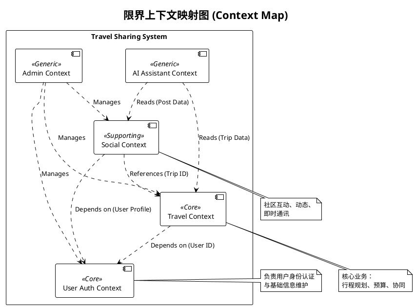
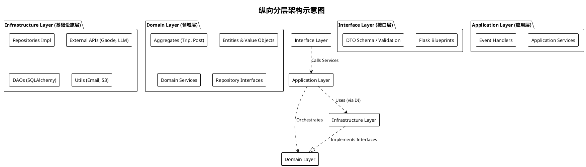
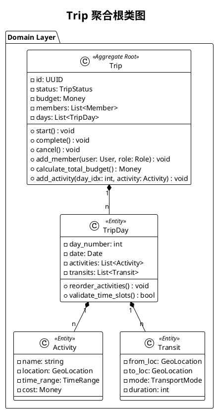
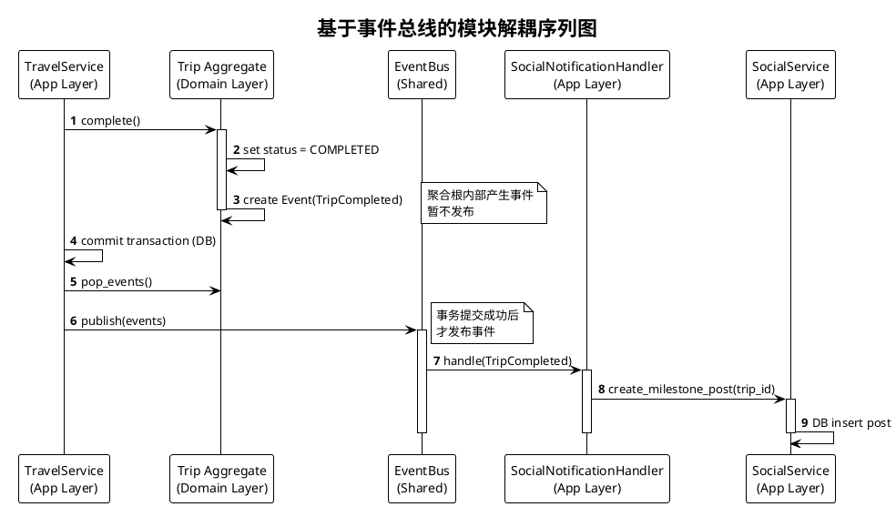

# 模块设计说明书 (Module Design Specification)

## 1. 引言

本项目“旅行信息分享应用”采用**领域驱动设计 (Domain-Driven Design, DDD)** 的思想进行架构设计，旨在构建一个高内聚、低耦合、易于维护和扩展的模块化单体 (Modular Monolith) 系统。

系统后端基于 **Python Flask** 框架，前端采用 **React.js**。为了应对复杂的业务逻辑（如行程规划、协同编辑、实时社交、AI 助手），后端架构摒弃了传统的 MVC（Model-View-Controller）模式，转而采用 **分层架构 (Layered Architecture)** 结合 **限界上下文 (Bounded Contexts)** 的策略。

本设计文档将从**横向（限界上下文划分）**和**纵向（分层架构设计）**两个维度详细阐述系统的模块设计。

---

## 2. 横向架构：限界上下文 (Bounded Contexts)

在横向维度上，我们将整个业务领域划分为五个独立的限界上下文。每个上下文代表一个特定的业务领域边界，内部拥有独立的通用语言（Ubiquitous Language）、领域模型和数据库表结构（尽管物理上可能共享同一个数据库实例，但逻辑上保持隔离）。

### 2.1 用户认证上下文 (`app_auth`)
该模块负责整个系统的身份与访问管理（IAM），是所有其他模块的基础。
*   **核心职责**：
    *   **身份验证**：处理用户的注册、登录、登出流程。支持基于 JWT (JSON Web Token) 的无状态认证机制。
    *   **密码安全**：负责用户密码的加盐哈希存储（使用 bcrypt 等算法），确保敏感数据安全。
    *   **用户档案**：维护用户的基本信息（ID、用户名、邮箱、头像、个人简介、地理位置等）。
    *   **权限控制**：虽然目前角色较为简单（普通用户、管理员），但该模块预留了基于角色的访问控制（RBAC）接口。

### 2.2 旅行核心上下文 (`app_travel`)
这是业务最核心的部分，承载了应用的主要价值——旅行规划与管理。
*   **核心职责**：
    *   **行程管理 (Trip Management)**：创建、编辑、删除多日行程。管理行程的元数据（预算、日期、封面图、可见性权限）。
    *   **日程规划 (Itinerary Planning)**：行程被细化为多个“日程日 (TripDay)”，每一天包含具体的活动 (Activity) 和交通 (Transit)。
    *   **协同机制**：支持多用户加入同一个行程，区分“创建者”、“管理员”和“普通成员”角色，处理并发编辑和权限校验。
    *   **路线计算**：集成高德地图 API，根据活动地点自动计算交通路径、耗时和距离。
    *   **预算控制**：自动汇总各个活动和交通的费用，提供预算使用情况的实时反馈。

### 2.3 社交互动上下文 (`app_social`)
该模块负责构建用户之间的连接，提升平台的用户粘性和活跃度。
*   **核心职责**：
    *   **社区动态 (Feed)**：用户可以将行程转化为游记 (Post) 发布到广场。支持多图上传、富文本编辑。
    *   **互动系统**：实现点赞 (Like)、评论 (Comment) 功能。支持多级评论（楼中楼）。
    *   **好友关系**：管理用户之间的关注或好友链接，处理好友申请的状态流转（申请中、已通过、已拒绝）。
    *   **即时通讯 (IM)**：基于 WebSocket (Flask-SocketIO) 实现实时聊天。支持私信 (Direct Message) 和群组聊天，处理在线状态和消息推送。

### 2.4 AI 智能助手上下文 (`app_ai`)
利用大语言模型 (LLM) 为用户提供智能化的旅行辅助服务。
*   **核心职责**：
    *   **智能问答**：集成 DeepSeek 等大模型，回答用户关于旅行目的地、签证政策、景点推荐等问题。
    *   **RAG (检索增强生成)**：结合本地数据库中的行程数据和帖子数据，构建向量索引或关键词索引。当用户提问时，先检索相关上下文，再由 AI 生成个性化回答（例如：“根据你的行程，明天去迪士尼需要准备...”）。
    *   **行程生成**：根据用户的一句话描述（“我想去云南玩5天，预算5000”），自动生成结构化的行程草稿。

### 2.5 后台管理上下文 (`app_admin`)
提供给系统运营人员使用的管理界面。
*   **核心职责**：
    *   **资源监控**：查看系统内的用户总数、行程总数、日活等关键指标。
    *   **内容审核**：对违规的帖子、评论或用户进行封禁或删除处理。
    *   **数据维护**：提供系统级别的配置管理和数据修正工具。

---

## 3. 纵向架构：分层设计 (Layered Architecture)

为了解耦业务逻辑与技术实现，在每个限界上下文内部，我们严格遵循四层架构模型。数据流向原则上由外向内，内层不依赖外层。

### 3.1 接口层 (Interface Layer / View Layer)
*   **物理位置**：`src/app_<module>/view/`
*   **职责**：这是系统的“门户”，负责与外部世界（前端 React 应用）交互。
*   **设计细节**：
    *   使用 Flask 的 **Blueprint** 机制注册路由，将 URL 映射到具体的视图函数。
    *   **输入适配**：解析 HTTP 请求体（JSON），进行基础的格式校验（如字段是否缺失、类型是否正确）。
    *   **依赖组装**：在请求处理入口，负责实例化应用服务 (Application Service)，并通过依赖注入（手动或容器化）将 Repository 和 Domain Service 注入其中。
    *   **输出适配**：将应用层返回的领域对象 (Domain Object) 或 DTO (Data Transfer Object) 序列化为前端可消费的 JSON 格式。

### 3.2 应用层 (Application Layer / Service Layer)
*   **物理位置**：`src/app_<module>/services/`
*   **职责**：作为业务流程的**编排者 (Orchestrator)**。
*   **设计细节**：
    *   **用例对应**：每个公共方法通常对应一个用户用例（Use Case），如 `create_trip`, `publish_post`。
    *   **事务控制**：定义数据库事务的边界。确保一个业务操作中的所有数据库变更要么全部成功，要么全部回滚。
    *   **流程编排**：它不包含复杂的业务规则，而是指挥领域对象做事。例如：“从库里取出 Trip -> 调用 Trip.add_member() -> 保存 Trip”。
    *   **领域事件发布**：在业务操作完成后，负责收集聚合根产生的领域事件 (Domain Events)，并通过 `EventBus` 分发给其他模块（例如：行程创建后，通知社交模块生成动态）。

### 3.3 领域层 (Domain Layer)
*   **物理位置**：`src/app_<module>/domain/`
*   **职责**：系统的**心脏**，封装所有的业务规则、状态逻辑和领域知识。**该层完全纯净，不依赖任何外部框架（无 Flask, 无 SQLAlchemy 引用）。**
*   **核心组件**：
    *   **聚合根 (Aggregate Root)**：如 `Trip`。它是修改数据的唯一入口，保证聚合内部的数据一致性。例如，在 `Trip` 中添加活动时，会自动校验日期是否在行程范围内。
    *   **实体 (Entity)**：如 `TripDay`, `Activity`。有唯一标识，但生命周期依赖于聚合根。
    *   **值对象 (Value Object)**：如 `Money`, `DateRange`。不可变对象，通过属性值定义身份。
    *   **领域服务 (Domain Service)**：当某个逻辑不属于任何单一实体时（如复杂的路径规划算法），由领域服务承载。
    *   **仓储接口 (Repository Interface)**：定义持久化的抽象契约（如 `save`, `find_by_id`），具体实现由基础设施层提供。这体现了**依赖倒置原则 (DIP)**。

### 3.4 基础设施层 (Infrastructure Layer)
*   **物理位置**：`src/app_<module>/infrastructure/`
*   **职责**：提供技术实现支撑，是领域层接口的“落地”之处。
*   **设计细节**：
    *   **持久化实现**：实现 Repository 接口。使用 SQLAlchemy ORM 操作数据库。
    *   **持久化对象 (PO)**：定义与数据库表结构一一对应的类（如 `TripPO`）。Infrastructure 层负责将 领域对象 (DO) 与 持久化对象 (PO) 进行相互转换 (Mapping)。
    *   **外部适配器**：封装第三方 API 的调用细节。例如 `GaodeGeoServiceImpl` 实现了领域层的 `IGeoService` 接口，内部处理高德地图 HTTP API 的请求、签名和重试。
    *   **通用设施**：日志记录、邮件发送、文件存储（S3/本地）的具体实现。

---

## 4. 关键模块详细设计与实现策略

### 4.1 旅行模块：充血模型 (Rich Domain Model) 的实践
在 `app_travel` 中，我们极力避免“贫血模型”（即实体只有 Getter/Setter，逻辑全在 Service）。

*   **设计示例**：`Trip` 聚合根。
    *   **状态流转**：`Trip` 内部维护 `status` 字段。调用 `trip.start()` 时，类内部会校验当前状态是否允许开始，并自动更新 `updated_at` 和 `status`，而不是由 Service 层去直接 set 字段。
    *   **一致性保护**：在 `add_activity` 时，`Trip` 会委托 `TripDay` 实体进行时间冲突检测。如果新活动与已有活动时间重叠，领域层会抛出业务异常，阻止无效数据的产生。
    *   **成本计算**：`Trip` 提供 `calculate_total_budget()` 方法，递归遍历所有 `TripDay` -> `Activity` -> `Transit` 进行累加。这使得预算计算逻辑高度内聚，任何地方需要计算预算只需调用该方法。

### 4.2 社交模块：CQRS 与读写分离的雏形
`app_social` 面临高频读取（刷 Feed 流）和高并发写入（点赞/聊天）的挑战。
*   **写入侧 (Command)**：通过 `PostService` 处理发帖、点赞。这些操作通过 Repository 写入规范化设计的 MySQL 表（`posts`, `likes`, `comments`），保证数据强一致性。
*   **读取侧 (Query)**：虽然暂未引入独立的 NoSQL，但在设计上我们通过 DAO (Data Access Object) 层分离了查询逻辑。对于复杂的 Feed 流查询（“查询我关注的人发布的最新帖子，按时间倒序”），专门编写了优化的 SQL 查询（或 SQLAlchemy 查询构建器），而不是简单的遍历实体，提高了列表加载性能。

### 4.3 基础设施：Repository 与 DAO 的分工
项目中同时存在 Repository 和 DAO，两者的定位有清晰界限：
*   **Repository**：服务于**领域层**。它操作的是完整的聚合根对象。例如 `trip_repo.save(trip)` 会级联保存 trip 下的 days, activities, members。它隐藏了底层是 1 张表还是 5 张表的细节。
*   **DAO (Data Access Object)**：服务于**查询需求**（通常是应用层或报表需求）。它直接返回 DTO 或 PO 列表，不涉及领域模型的重建。例如，后台管理列表需要展示“所有用户的发帖数量”，这只需要一个简单的 `count()` 聚合查询，使用 DAO 更加轻量高效，无需加载所有 Post 实体。

### 4.4 模块间通信：领域事件总线 (Event Bus)
为了解耦各个限界上下文，我们引入了内存级别的事件总线。

*   **场景**：当 `app_travel` 中的行程结束 (`TripCompleted`) 时，系统需要自动在 `app_social` 中发布一条动态，并给用户增加积分。
*   **实现**：
    1.  `TravelService` 完成事务后，发布 `TripCompletedEvent`。
    2.  `EventBus` 捕获该事件。
    3.  `app_social` 注册的 `TripNotificationHandler` 被触发。
    4.  Handler 调用 `SocialService` 执行相关逻辑。
*   **优势**：`app_travel` 不需要 import `app_social` 的代码，两者通过共享的 `shared/domain_event.py` 定义进行松耦合协作。

## 5. 总结
本模块设计通过**横向的限界上下文划分**明确了业务边界，通过**纵向的分层架构**隔离了业务逻辑与技术实现。这种设计不仅满足了当前的课程设计需求，更为未来可能的微服务拆分（将 Context 独立部署）打下了坚实的架构基础。代码结构清晰，职责单一，体现了现代软件工程的高内聚低耦合原则。