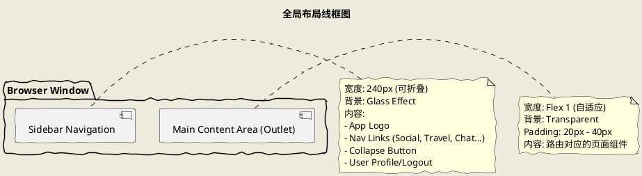
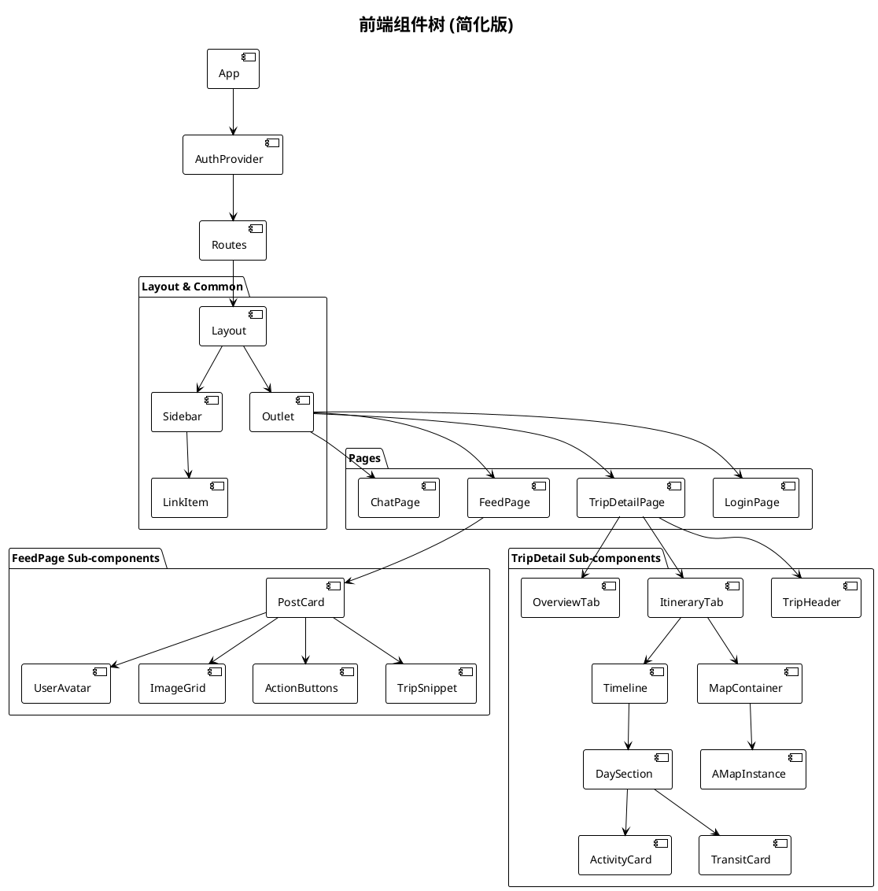

# 用户界面 (UI) 详细设计说明书

## 1. 引言

### 1.1 文档目的
本文档旨在详细描述“旅行信息分享应用”的前端用户界面设计。文档涵盖了视觉设计规范、全局布局架构、页面详细设计、交互逻辑以及组件层级结构。此文档将作为前端开发、UI验收及用户体验测试的依据，确保最终产品在视觉上的一致性和交互上的流畅性。

### 1.2 适用范围
本文档适用于基于 React.js 开发的 Web 客户端应用，包括所有公开页面（登录、注册）、受保护的用户功能页面（社交、旅行、聊天、AI助手）以及后台管理界面。

### 1.3 设计理念
*   **Glassmorphism (玻璃拟态)**：采用深色背景搭配半透明磨砂玻璃效果，营造现代、科技感且具有深度的视觉体验。
*   **以内容为中心**：界面布局简洁，通过合理的留白和层级关系，突出旅行图片、行程地图和社交动态等核心内容。
*   **响应式布局**：虽然主要针对桌面端优化，但通过 Flexbox 和 Grid 布局保证了在不同分辨率屏幕下的适应性。
*   **即时反馈**：利用 React Hot Toast 提供操作结果的即时通知，结合 Loading Spinners 缓解用户等待焦虑。

---

## 2. 视觉设计系统 (Visual Design System)

### 2.1 基础色板 (Color Palette)

系统采用“暗夜玻璃”配色方案，主色调为深蓝灰色，辅以霓虹蓝作为强调色。

| 变量名 | 颜色值 (参考) | 用途描述 |
| :--- | :--- | :--- |
| `--bg-primary` | `#0f172a` (Deep Slate Blue) | 全局背景色，模拟深邃夜空 |
| `--bg-secondary` | `rgba(30, 41, 59, 0.7)` | 卡片、侧边栏背景，带透明度 |
| `--text-primary` | `#f1f5f9` (Bright White) | 主要标题、正文文本 |
| `--text-secondary` | `#94a3b8` (Blue Gray) | 次级文本、说明文字、未选中图标 |
| `--color-primary` | `#60a5fa` (Blue) | 品牌主色，用于按钮、链接、高亮 |
| `--color-travel` | `#06B6D4` (Cyan) | 旅行模块主题色 |
| `--color-danger` | `#ef4444` (Red) | 删除、错误提示 |

### 2.2 字体排版 (Typography)

全局字体栈优先使用系统默认无衬线字体，确保加载速度和操作系统原生体验。

*   **Font Family**: `-apple-system, BlinkMacSystemFont, "Segoe UI", Roboto, Helvetica, Arial, sans-serif`
*   **字号层级**:
    *   **H1 (Page Title)**: 24px - 32px, Bold
    *   **H2 (Section Title)**: 20px - 24px, Semi-Bold
    *   **H3 (Card Title)**: 16px - 18px, Medium
    *   **Body (Regular)**: 14px - 16px, Regular
    *   **Small (Caption)**: 12px, Regular, Text-Secondary

### 2.3 阴影与特效 (Effects)

*   **Glassmorphism**:
    *   `background`: `rgba(255, 255, 255, 0.05)` (超轻微白) 或 `var(--bg-secondary)`
    *   `backdrop-filter`: `blur(12px)` (背景模糊)
    *   `border`: `1px solid rgba(255, 255, 255, 0.1)` (微光边框)
*   **Shadows**:
    *   `--glass-shadow`: `0 8px 32px 0 rgba(0, 0, 0, 0.3)` (深邃阴影，增加层次感)
*   **Transitions**: 全局交互元素（按钮、卡片）具备 `0.2s` 或 `0.3s` 的 `ease-in-out` 过渡效果。

---

## 3. 全局布局架构 (Global Layout)

### 3.1 主应用布局 (`Layout.jsx`)

应用采用经典的 **左侧导航 + 右侧内容** 布局结构，最大化利用宽屏空间展示地图和信息流。

#### 3.1.1 侧边导航栏 (Sidebar)
*   **位置**：屏幕左侧固定。
*   **状态**：支持展开（显示图标+文字）和折叠（仅显示图标）两种模式，通过底部的 `Chevron` 按钮切换。
*   **导航项**：
    *   **社区 (Social)**: 图标 `Globe`，链接至 `/social`
    *   **旅行 (Travel)**: 图标 `Map`，链接至 `/travel`
    *   **消息 (Chat)**: 图标 `MessageSquare`，链接至 `/chat`
    *   **TripMateAI**: 图标 `Bot`，链接至 `/ai-assistant`
    *   **我的 (Profile)**: 图标 `User`，链接至 `/profile/:id`
*   **交互**：当前激活路由对应的导航项会有高亮背景色（根据模块不同，高亮色略有差异，如 Social 为蓝色，Travel 为青色）。

#### 3.1.2 内容区域 (Main)
*   **位置**：屏幕右侧剩余空间。
*   **特性**：包含 `<Outlet />` 组件，用于渲染子路由页面。具备独立的滚动条（`overflow-y: auto`），确保侧边栏始终可见。

---

## 4. 详细页面设计 (Page Designs)

### 4.1 认证模块 (Authentication)

#### 4.1.1 登录/注册页 (`LoginPage.jsx`, `RegisterPage.jsx`)
*   **布局**：全屏居中卡片布局。背景为带有动态渐变的深色背景。
*   **组件**：
    *   **Logo**：顶部展示大号应用 Logo。
    *   **表单**：包含 `Input` 组件（用户名/邮箱、密码）。注册页额外包含“确认密码”。
    *   **按钮**：主操作按钮（登录/注册）宽度填满。
    *   **切换链接**：底部提供“去注册”或“去登录”的文本链接。
*   **反馈**：表单验证失败时，输入框变红并显示下方错误提示文本。

### 4.2 社交模块 (Social Context)

#### 4.2.1 社区动态页 (`FeedPage.jsx`)
*   **布局**：单列瀑布流或列表布局，居中显示，宽度限制在 600px - 800px 以提升阅读体验。
*   **顶部栏**：
    *   包含“发现”和“关注”两个标签页切换 (`TabSwitcher`)。
    *   右侧悬浮或固定位置的“发布动态”按钮 (`Floating Action Button`)。
*   **内容流**：
    *   **PostCard 组件**：
        *   **头部**：作者头像、昵称、发布时间、更多操作（删除/举报）。
        *   **内容**：文本内容（支持截断展开），图片网格（1-9张自适应排列）。
        *   **关联行程**：如果帖子关联了行程，显示一个微型的行程卡片 (`TripSnippet`)，点击可跳转。
        *   **底部动作栏**：点赞（图标+数量）、评论（图标+数量）、分享。
*   **交互**：点击 PostCard 进入详情页；点击图片开启大图预览 (`Lightbox`)。

#### 4.2.2 帖子详情页 (`PostDetailPage.jsx`)
*   **布局**：左侧为帖子详情及大图，右侧为评论区（桌面端）；移动端为垂直堆叠。
*   **评论区**：
    *   **输入框**：底部固定，支持文本输入。
    *   **列表**：树形结构展示评论和回复（楼中楼）。

#### 4.2.3 即时通讯页 (`ChatPage.jsx`)
*   **布局**：经典的两栏布局（左侧会话列表，右侧聊天窗口）。
*   **左侧会话列表**：
    *   搜索框：搜索联系人。
    *   列表项：展示好友头像、昵称、最后一条消息预览、未读红点。
    *   新建按钮：发起新聊天或创建群组。
*   **右侧聊天窗口**：
    *   **头部**：当前聊天对象信息（在线状态）。
    *   **消息流**：气泡式对话。我发送的在右侧（蓝色气泡），对方发送的在左侧（灰色气泡）。
    *   **输入区**：文本框、表情按钮、图片上传按钮、发送按钮。
    *   **特殊消息**：支持渲染“行程分享卡片”，点击可查看行程详情。

### 4.3 旅行模块 (Travel Context)

#### 4.3.1 旅行首页 (`TravelPage.jsx`)
*   **布局**：仪表盘式布局。
*   **概览卡片**：展示“即将开始的行程”、“总足迹数”等统计数据。
*   **快捷入口**：两个大卡片分别通往“我的行程” (`MyTripsPage`) 和“旅行广场” (`PublicTripsPage`)。

#### 4.3.2 行程列表页 (`MyTripsPage.jsx`)
*   **布局**：网格布局 (Grid Layout)，响应式列数（大屏3列，中屏2列）。
*   **TripCard 组件**：
    *   **封面**：顶部大图，覆盖有状态标签（规划中/进行中/已结束）。
    *   **信息**：标题、日期范围、目的地。
    *   **成员**：重叠显示的成员头像组。
    *   **操作**：编辑、删除按钮。

#### 4.3.3 行程详情页 (`TripDetailPage.jsx`)
这是一个功能密集的复杂页面，采用 **标签页 (Tabs)** 结构组织内容。

*   **Header**：全宽封面图，叠加显示行程标题、日期、创建者信息。右侧有“邀请成员”、“设置”按钮。
*   **Tabs**:
    1.  **日程 (Itinerary)**:
        *   左侧：时间轴视图 (`Timeline`)，按天 (`Day 1`, `Day 2`) 分组展示活动 (`Activity`) 和交通 (`Transit`)。
        *   右侧：地图视图 (`MapContainer`)，基于高德地图，渲染当天的活动地点标记 (`Marker`) 和交通路线 (`Polyline`)。
        *   交互：点击时间轴上的活动，地图自动聚焦到对应标记；点击地图标记，时间轴滚动到对应卡片。
    2.  **概览 (Overview)**: 预算图表（饼图）、成员列表、备注信息。
    3.  **相册 (Gallery)**: 瀑布流展示该行程相关的所有图片。

### 4.4 AI 助手模块 (AI Assistant)

#### 4.4.1 AI 对话页 (`AiChatPage.jsx`)
*   **布局**：类似 ChatPage 的全屏对话界面。
*   **特色组件**：
    *   **Suggestion Chips**：对话框上方的一排快捷提示词（如“帮我规划去日本的行程”、“推荐适合亲子的景点”）。
    *   **Markdown 渲染器**：AI 的回复支持 Markdown 格式，可渲染列表、加粗、链接。
    *   **推荐卡片**：当 AI 推荐景点或行程时，直接渲染可视化的卡片组件，而非纯文本。

---

## 5. 组件层级设计 (Component Hierarchy)

---

## 6. 交互与状态流转 (Interaction Flows)

### 6.1 创建行程交互流

用户从点击“创建行程”到完成初始规划的流程。

1.  **入口**：在“旅行”页面点击 Floating Action Button (+) 或“创建新行程”卡片。
2.  **模态框 1 (基本信息)**：
    *   弹出 `CreateTripModal`。
    *   用户输入：标题、起止日期、预算。
    *   操作：点击“下一步”。
3.  **状态更新**：后端创建 Trip 记录，前端跳转至 `TripDetailPage`。
4.  **添加日程**：
    *   用户在时间轴点击“添加活动”。
    *   弹出 `AddActivityModal`。
    *   **地图交互**：模态框内嵌地图搜索，用户输入关键词（如“故宫”），选择下拉联想词。
    *   **自动填充**：系统自动填入地点名称、经纬度。用户补充时间。
    *   提交后，时间轴新增一张卡片，右侧地图新增一个标记，并自动重新计算路线。

### 6.2 实时聊天交互流

1.  **连接**：进入 `ChatPage`，`Socket.io` 客户端建立连接，加入以 UserID 命名的房间。
2.  **发送**：
    *   用户输入文字，点击发送。
    *   前端立即将消息 optimistic update（乐观更新）到 UI 列表底部（灰色状态）。
    *   通过 HTTP POST 发送消息给后端。
3.  **接收**：
    *   后端持久化成功，Socket 广播 `new_message` 事件。
    *   如果是自己发的消息，更新状态为“发送成功”。
    *   如果是对方发的消息，若当前在对话窗口内，直接追加到列表；若不在，左侧列表项显示未读红点。

---

## 7. 响应式与适配策略 (Responsive Strategy)

虽然主要针对桌面端（1280px+）设计，但通过 CSS Modules 和 Flexbox 实现了基本的向下兼容：

*   **Mobile (< 768px)**:
    *   **侧边栏**：隐藏，转变为底部的 TabBar 导航 (`BottomNavigation`)。
    *   **布局**：多列 Grid 自动坍缩为单列 (`grid-template-columns: 1fr`)。
    *   **地图**：在 `TripDetailPage` 中，地图和时间轴不再并列，而是通过顶部的 Toggle Switch 切换显示（“地图模式” vs “列表模式”）。
    *   **模态框**：自动变为全屏弹窗 (`bottom-sheet` 风格)。

---

## 8. 总结

本 UI 设计方案旨在构建一个沉浸式、高效率的旅行分享平台。通过暗色玻璃拟态风格确立了独特的视觉语言，清晰的左侧导航结构保证了易用性。特别是旅行详情页的“地图-时间轴”联动设计，不仅解决了信息展示的复杂性，更增强了用户规划行程时的直观感受。组件化的设计思路（如复用 `TripCard`, `PostCard`）也极大地提高了开发效率和代码的可维护性。
