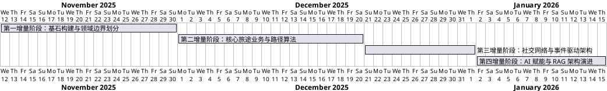

# Travel Sharing 智能伴游平台：增量开发与演进报告

## 1. 项目概况与职责分工
本项目采用增量模型（Incremental Model）进行敏捷迭代，自 2025年11月12日 启动，历经四个关键阶段的演进，目前已形成集旅行规划、社交互动与 AI 智能助手于一体的综合性平台。

**项目核心成员职责划分：**
*   **产品经理 / 前端负责人 (朱鹏)**：负责需求深度分析、用户交互原型设计、前端核心业务组件开发（尤其是社交与动态模块）以及系统验收测试（UAT）。
*   **系统架构师 / 后端负责人 (赖泓旭)**：主导领域驱动设计（DDD）架构搭建、后端微服务模块开发（Auth/Travel/Social/AI）、数据库建模、算法实现及智能化组件研发。

---

## 2. 增量阶段详细报告

### 项目进度甘特图

### 第一增量阶段：基石构建与领域边界划分（2025.11.12 - 2025.11.30）
**阶段目标**：建立系统骨架，确立安全规范与领域模型基础。

在此阶段，**朱鹏**主导了早期的需求调研，明确了平台“身份可信、数据安全”的核心原则，并产出了高保真的前端交互原型，为后续开发提供了清晰的蓝图。
**赖泓旭**则专注于系统架构的落地：
1.  **架构搭建**：确立了前后端分离的整体架构，采用 Flask 作为后端框架，引入了标准的 DDD 分层目录结构（`domain`, `infrastructure`, `services`），确保了业务逻辑与基础设施的解耦。
2.  **鉴权体系 (`app_auth`)**：设计并实现了基于 JWT 的无状态认证机制。通过 `SQLAlchemy` 构建了 `User` 聚合根及其持久化模型，完成了密码哈希存储、登录校验及 Token 分发流程，为后续所有业务模块提供了统一的安全屏障。
3.  **基础设施**：配置了数据库连接池与基础 ORM 映射规则，确立了统一的异常处理与日志规范。

---

### 第二增量阶段：核心旅途业务与路径算法实现（2025.12.01 - 2025.12.20）
**阶段目标**：攻克最核心的行程规划与路线计算难题。

**朱鹏**在此期间细化了“路线规划”与“行程分享”的颗粒度需求，定义了动态发布与时间轴展示的交互逻辑，确保用户体验的连贯性。
**赖泓旭**完成了 `app_travel` 核心模块的深度开发：
1.  **领域建模**：设计了复杂的 `Trip` 聚合根，内部包含 `TripDay`、`Activity`、`Transit` 等实体，实现了业务逻辑的高度内聚（充血模型）。
2.  **智能路线算法**：编写了 `ItineraryService` 与 `recalculate_routes.py` 脚本。通过集成高德地图 API (`GaodeGeoServiceImpl`)，实现了活动间交通方式（驾车/步行/公交）的自动计算与成本估算。特别是在 `calculate_transits_between_activities` 方法中，实现了基于地理位置的活动自动排序与路径补全逻辑。
3.  **数据持久化**：完成了 `travel_sharing.db` 核心表结构（`trips`, `trip_days`, `activities`）的设计与迁移，实现了复杂对象图的级联保存。

---

### 第三增量阶段：社交网络与事件驱动架构（2025.12.21 - 2026.01.01）
**阶段目标**：构建用户粘性网络，实现实时互联。

**朱鹏**主要负责社交功能的前端实现，包括即时通讯窗口的 UI 开发与 WebSocket 客户端状态管理，编写了详细的测试用例以验证消息的实时性。
**赖泓旭**攻克了 `app_social` 模块的技术挑战，引入了事件驱动架构：
1.  **实时通讯**：基于 `Flask-SocketIO` 实现了双向通信通道。在 `handlers.py` 中通过 `register_social_socket_handlers` 注册了消息监听器，利用 `join_room` 机制实现了私密会话与群组聊天的数据隔离。
2.  **领域事件总线**：构建了 `EventBus` 机制。当用户发送消息或建立好友关系时，系统会发布 `MessageSentEvent` 或 `FriendshipCreatedEvent`，解耦了业务逻辑与即时通知服务。
3.  **好友与群组逻辑**：实现了 `FriendshipService` 与 `SocialService`，处理复杂的好友申请状态流转（Pending/Accepted/Rejected）及会话成员管理。

---

### 第四增量阶段：AI 赋能与 RAG 架构演进（2026.01.02 - 至今）
**阶段目标**：引入大模型能力，打造差异化竞争优势。

目前项目正处于最具挑战的智能化增量阶段。**赖泓旭**正在主导 `app_ai` 模块的研发，构建了基于 RAG（检索增强生成）的智能助手：
1.  **混合检索器**：编写了 `sqlalchemy_mysql_retriever.py`，实现了对 `Activity`（活动）、`Trip`（行程）、`Post`（游记）的多维度混合检索，能够根据用户问题上下文精准召回相关业务数据。
2.  **LLM 集成**：通过适配器模式集成了 DeepSeek 大模型，设计了 `AiApplicationService` 来编排“检索-增强-生成”的完整流水线，支持流式响应（Streaming Response）。
3.  **知识库构建**：正在优化向量索引与关键词提取算法，以提升 AI 对旅行特定领域术语的理解能力。

**朱鹏**则同步进行 AI 交互场景的集成测试，重点验证在弱网环境下 AI 响应的降级策略及前端渲染性能，确保智能助手能平滑嵌入现有业务流中。

---

## 3. 总结
经过近两个月的紧密协作，团队成功落地了预期的分层架构。从早期的单体 CRUD 到引入事件驱动与 WebSocket，再到最新的 RAG 智能化实践，项目技术栈不断升级，代码结构保持了高度的清晰与可维护性。
