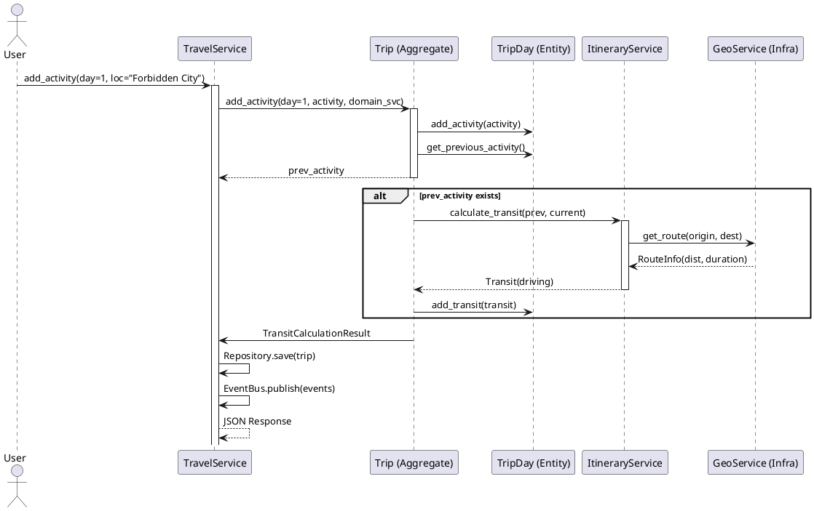

# 项目综合分析与架构评审

## 1. 系统概述

“旅行信息分享应用”是一个集成了旅行规划、社交互动和智能辅助功能的综合性平台。系统旨在解决用户在旅行前、行中、行后三个阶段的不同痛点：
*   **行前**：通过结构化的行程规划工具和社区攻略检索，降低信息收集与决策成本。
*   **行中**：提供智能的路线规划和团队协作功能，解决实时交通查询与多人协同问题。
*   **行后**：基于图文游记的社交分享，满足用户的记录与展示需求。

系统采用 **前后端分离** 架构，后端基于 **Python Flask** 框架，前端采用 **React.js**。核心设计思想贯彻了 **领域驱动设计 (DDD)**，将复杂的业务逻辑封装在领域层，实现了业务规则与技术实现的解耦。

## 2. 核心架构分析

### 2.1 领域驱动设计 (DDD) 落地实践
本项目在代码组织上严格遵循了 DDD 的四层架构，这种设计在 Python Web 项目中较为少见但极具价值。

*   **用户接口层 (Interface Layer)**:
    *   位于 `view/` 目录，如 `travel_view.py`。
    *   **职责**：仅负责 HTTP 请求解析、参数校验、DTO 转换及响应封装。它不包含任何业务逻辑，只是 Application Service 的“哑”消费者。
*   **应用层 (Application Layer)**:
    *   位于 `services/` 目录，如 `TravelService`。
    *   **职责**：作为业务流程的编排者 (Orchestrator)。它协调聚合根 (Trip) 和领域服务 (ItineraryService) 完成用例，管理数据库事务边界，并负责发布领域事件 (Event Publishing)。它本身保持无状态。
*   **领域层 (Domain Layer)**:
    *   位于 `domain/` 目录。
    *   **核心资产**：
        *   **聚合根 (Trip, Post)**：实现了“充血模型”。例如 `Trip.add_activity()` 方法不仅修改数据，还内置了状态检查（如“已完成行程不可修改”）和业务规则校验。
        *   **领域服务 (ItineraryService)**：处理跨实体的复杂逻辑，如调用地理服务计算两点间的交通。
        *   **领域事件 (Events)**：如 `TripCreatedEvent`, `ActivityAddedEvent`，解耦了副作用（如发通知、统计更新）。
*   **基础设施层 (Infrastructure Layer)**:
    *   位于 `infrastructure/` 目录。
    *   **职责**：提供技术实现细节，如 SQLAlchemy 的 DAO 实现 (`SqlAlchemyTripDao`)、高德地图 API 适配器 (`GaodeGeoServiceImpl`)。通过依赖倒置 (DIP)，领域层仅依赖接口 (`ITripRepository`)，而不感知具体数据库。

### 2.2 数据模型与持久化
系统采用 **MySQL** 作为主要存储，利用 SQLAlchemy ORM 进行对象关系映射。
*   **PO (Persistent Object) 与 Domain Entity 分离**：代码中明确区分了 `TripPO` (数据库映射) 和 `Trip` (领域实体)。Repository 负责两者间的转换。这种设计虽然增加了代码量，但保证了领域模型的纯净性，使其不受数据库表结构变更的影响。
*   **事务一致性**：`EventBus` 目前采用进程内同步发布机制。虽然简单，但在高并发或部分失败场景下缺乏最终一致性保障（例如：数据库提交成功但事件处理失败）。在未来的演进中，建议引入 Outbox 模式或消息队列 (RabbitMQ/Kafka) 来增强可靠性。

### 2.3 关键业务流程分析

#### 2.3.1 智能行程规划 (Intelligent Itinerary Planning)
这是系统的核心亮点。
*   **流程**：用户添加活动 -> `Trip` 聚合根委托 -> `ItineraryService` 计算交通 -> 更新 `TripDay` -> 触发重排。
*   **策略模式**：`ItineraryService` 内置了智能降级策略（距离<2km 步行，否则驾车/公交），体现了对业务场景的深入理解。
*   **UML 时序图**:

#### 2.3.2 RAG 增强问答 (RAG-based QA)
系统实现了一个轻量级的 RAG (Retrieval-Augmented Generation) 流程。
*   **检索策略**：采用简单的关键词匹配 + Jieba 分词。虽然没有使用向量数据库 (Vector DB)，但在数据量较小时，这种基于 SQL `LIKE` 的混合检索（同时查 Trip, Post, Activity）具有极高的性价比和可解释性。
*   **流式响应**：利用 Python Generator 实现 SSE (Server-Sent Events)，提升了 AI 回复的用户体验。

### 2.4 系统优缺点评审

#### 优点
1.  **架构清晰**：DDD 分层架构使得代码结构极具条理性，新功能的添加往往只需在特定层进行，维护成本低。
2.  **业务内聚**：充血模型有效地防止了业务逻辑泄露到 Service 层，保证了业务规则的一致性。
3.  **扩展性强**：接口定义清晰，基础设施层的替换（如更换地图服务商、更换 LLM 提供商）几乎不影响核心业务代码。

#### 缺点与风险
1.  **N+1 查询问题**：在 `serialize_trip` 等视图函数中，循环查询用户信息 (`g.session.query(UserPO)`) 可能会导致性能瓶颈。建议在 Repository 层使用 `joinedload` 预加载关联数据。
2.  **事件总线局限**：当前的 `EventBus` 是单机同步的，不支持分布式部署。若部署多实例，WebSocket 消息广播和跨进程事件将失效（需引入 Redis）。
3.  **大事务风险**：部分 Service 方法（如 `create_trip`）包含多个步骤，若其中网络请求（如地图 API）耗时过长，会长时间占用数据库连接。建议将非关键路径的外部调用异步化。

## 3. 演进建议

1.  **引入缓存层 (Redis)**：
    *   存储用户 Session，支持分布式部署。
    *   缓存热点数据（如广场 Feed 流、热门行程详情）。
2.  **搜索引擎升级**：
    *   随着数据量增长，SQL `LIKE` 查询性能会急剧下降。建议引入 **Elasticsearch** 或 **Meilisearch** 来接管全文检索和 RAG 检索需求。
3.  **异步任务队列 (Celery/RQ)**：
    *   将邮件发送、复杂的行程路线重算、图片上传处理等耗时任务剥离出主 Web 线程，提升 API 响应速度。

## 4. 总结

本项目是一个架构设计成熟、代码质量较高的全栈应用雏形。它不仅实现了基础的 CRUD 功能，更在复杂业务逻辑（如行程计算）和前沿技术整合（如 AI RAG）上做出了成功的探索。通过解决上述提到的性能与扩展性短板，该系统完全具备演化为商业级产品的潜力。
