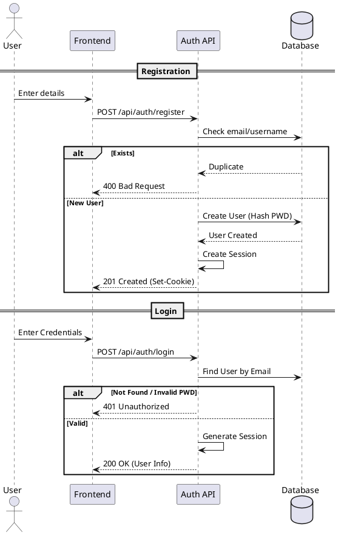
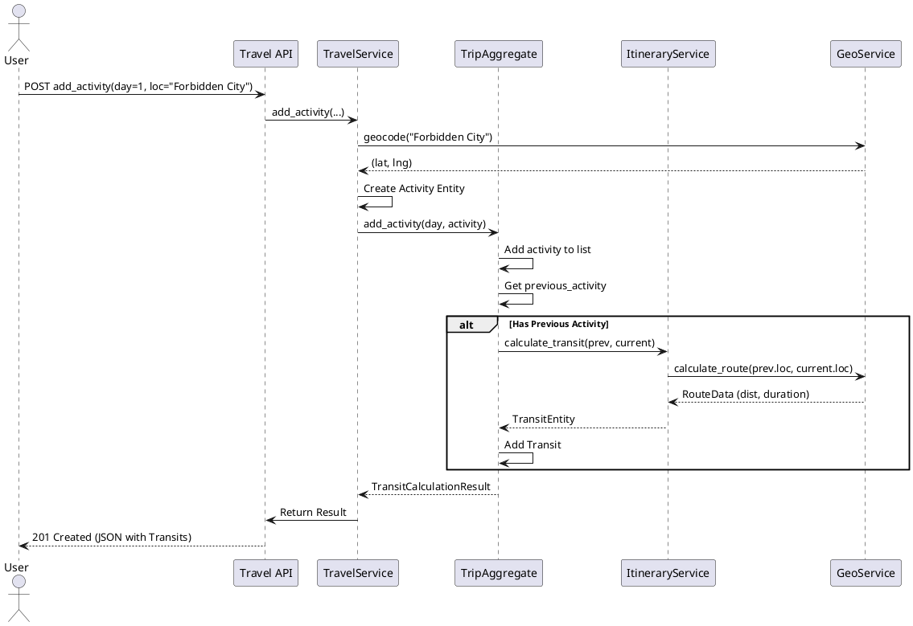
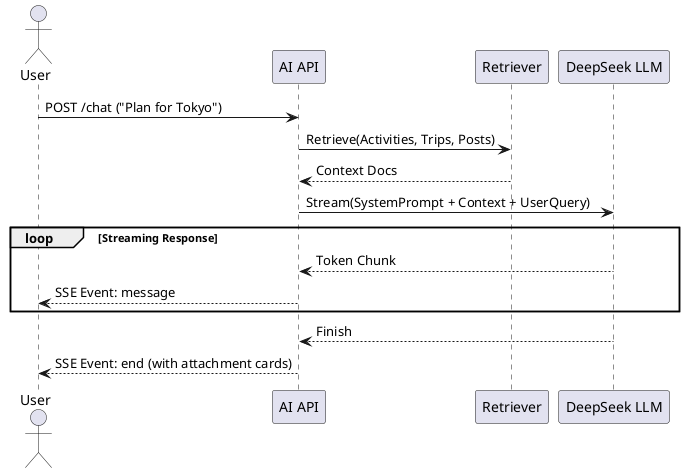
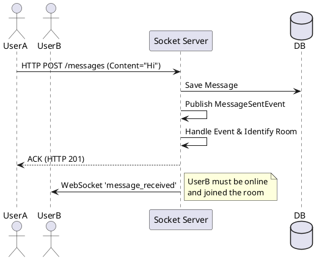

# 项目接口需求分析

## 1. 引言

本文档详细定义了旅行信息分享应用的接口规范，作为前后端开发、联调及测试的依据。接口设计遵循 RESTful 风格，采用 JSON 作为主要数据交换格式，部分实时交互功能基于 WebSocket 协议。

## 2. 总体规范

### 2.1 协议与格式
*   **通信协议**：HTTP/1.1 (REST API), WebSocket (实时消息), SSE (AI 流式响应)。
*   **请求格式**：
    *   `Content-Type: application/json`（常规请求）。
    *   `Content-Type: multipart/form-data`（文件上传）。
*   **响应格式**：`Content-Type: application/json`。
*   **字符编码**：UTF-8。

### 2.2 状态码规范 (HTTP Status Codes)
*   `200 OK`：请求成功。
*   `201 Created`：资源创建成功。
*   `204 No Content`：删除成功，无返回内容。
*   `400 Bad Request`：请求参数错误或业务校验失败。
*   `401 Unauthorized`：未登录或 Session 失效。
*   `403 Forbidden`：已登录但权限不足（如非管理员尝试删除群成员）。
*   `404 Not Found`：资源不存在。
*   `500 Internal Server Error`：服务器内部错误。

### 2.3 认证与鉴权
*   **认证方式**：基于 Server-side Session。登录成功后，服务器通过 `Set-Cookie` 下发 `session` cookie。
*   **鉴权机制**：
    *   **常规接口**：检查 Session 是否包含 `user_id`。
    *   **管理员接口**：检查 Session 中 `user_id` 对应的用户角色是否为 `admin`。
    *   **资源操作**：在业务逻辑层校验资源归属（如“只有作者能修改帖子”）。

---

## 3. 模块接口详解

### 3.1 用户认证模块 (Auth Module)
**Base URL**: `/api/auth`

| 方法 | 路径 | 描述 | 请求参数/Body | 响应示例 |
| :--- | :--- | :--- | :--- | :--- |
| POST | `/register` | 用户注册 | `{ "username": "alice", "email": "alice@ex.com", "password": "..." }` | `{ "id": "...", "username": "..." }` (201) |
| POST | `/login` | 用户登录 | `{ "email": "...", "password": "..." }` | `{ "id": "...", "profile": { ... } }` (200) |
| POST | `/logout` | 用户登出 | - | `{ "message": "Logged out" }` (200) |
| GET | `/me` | 获取当前用户信息 | - | `{ "id": "...", "email": "...", "role": "..." }` |
| PUT | `/me/profile` | 更新个人资料 | **JSON或FormData** <br> `location`, `bio`, `avatar` (File) | `{ "profile": { "avatar_url": "...", "bio": "..." } }` |
| GET | `/users/{id}` | 获取特定用户信息 | - | `{ "id": "...", "username": "...", "profile": { ... } }` |
| POST | `/change-password` | 修改密码 | `{ "old_password": "...", "new_password": "..." }` | `{ "message": "Success" }` |

**注册登录流程图 (PlantUML)**



---

### 3.2 旅行核心模块 (Travel Module)
**Base URL**: `/api/travel`

#### 3.2.1 行程基础 (Trip CRUD)

| 方法 | 路径 | 描述 | 请求参数/Body | 响应示例 |
| :--- | :--- | :--- | :--- | :--- |
| POST | `/trips` | 创建行程 | `{ "name": "Trip to Paris", "start_date": "2024-05-01", "end_date": "2024-05-05" }` | `{ "id": "trip_123", "days": [...] }` (201) |
| GET | `/trips/{id}` | 获取行程详情 | - | `{ "id": "...", "members": [...], "days": [...] }` |
| PUT | `/trips/{id}` | 更新行程信息 | `{ "name": "...", "visibility": "public" }` | `{ "id": "...", "name": "..." }` |
| DELETE | `/trips/{id}` | 删除行程 | - | 204 No Content |
| GET | `/users/{uid}/trips` | 获取用户行程列表 | Query: `status=planning` (可选) | `[ { "id": "...", "name": "..." }, ... ]` |
| GET | `/trips/public` | 广场公开行程 | Query: `limit=20`, `offset=0` | `[ { "id": "...", "cover_image_url": "..." }, ... ]` |
| GET | `/trips/{id}/statistics`| 获取统计报表 | - | `{ "total_distance_meters": 15000, "total_cost": ... }` |

#### 3.2.2 成员管理 (Members)

| 方法 | 路径 | 描述 | 请求参数/Body | 响应示例 |
| :--- | :--- | :--- | :--- | :--- |
| POST | `/trips/{id}/members` | 邀请/添加成员 | `{ "user_id": "u_123", "role": "member" }` | `{ "members": [ ... ] }` |
| DELETE | `/trips/{id}/members/{uid}` | 移除成员 | - | `{ "members": [ ... ] }` |

#### 3.2.3 日程与活动 (Itinerary)
这是最复杂的交互部分，涉及交通自动计算。

| 方法 | 路径 | 描述 | 请求参数/Body | 响应示例 |
| :--- | :--- | :--- | :--- | :--- |
| POST | `/trips/{tid}/days/{idx}/activities` | 添加活动 | `{ "name": "Louvre", "location_name": "...", "start_time": "09:00", "end_time": "11:00" }` | `{ "transits": [...], "warnings": [] }` <br> *返回计算出的交通信息* |
| PUT | `/trips/{tid}/days/{idx}/activities/{aid}` | 修改活动 | `{ "start_time": "10:00" }` | `{ "transits": [...] }` <br> *重新计算前后交通* |
| DELETE | `/trips/{tid}/days/{idx}/activities/{aid}` | 移除活动 | - | `{ "transits": [...] }` |
| PUT | `/trips/{tid}/days/{idx}/transits/{tr_id}` | 修改交通方式 | `{ "transport_mode": "driving" }` | `{ "id": "tr_id", "mode": "driving", "duration": ... }` |

**活动添加与交通计算时序图 (PlantUML)**



---

### 3.3 社交互动模块 (Social Module)
**Base URL**: `/api/social`

#### 3.3.1 帖子 (Posts)

| 方法 | 路径 | 描述 | 请求参数/Body | 响应示例 |
| :--- | :--- | :--- | :--- | :--- |
| POST | `/posts` | 发布帖子 | **FormData** <br> `title`, `content`, `media_files`, `trip_id` | `{ "post_id": "...", "created_at": "..." }` |
| GET | `/feed` | 获取信息流 | Query: `limit`, `offset`, `tags` | `[ { "id": "...", "images": [...] }, ... ]` |
| GET | `/posts/{id}` | 帖子详情 | - | `{ "id": "...", "comments": [...] }` |
| POST | `/posts/{id}/like` | 点赞/取消 | - | `{ "is_liked": true }` |
| POST | `/posts/{id}/comments` | 评论 | `{ "content": "Nice!", "parent_id": null }` | `{ "comment_id": "..." }` |

#### 3.3.2 聊天与好友 (Chat & Friends)

| 方法 | 路径 | 描述 | 请求参数/Body | 响应示例 |
| :--- | :--- | :--- | :--- | :--- |
| POST | `/conversations` | 创建私聊 | `{ "target_id": "user_b" }` | `{ "conversation_id": "conv_1" }` |
| POST | `/conversations/group` | 创建群聊 | `{ "title": "Trip Group", "participant_ids": [...] }` | `{ "conversation_id": "conv_2" }` |
| GET | `/conversations` | 会话列表 | - | `[ { "id": "...", "unread_count": 2 }, ... ]` |
| GET | `/conversations/{id}/messages` | 获取历史消息 | Query: `limit=50` | `[ { "id": "...", "content": "..." }, ... ]` |
| POST | `/conversations/{id}/messages` | 发送消息 | `{ "content": "Hello", "type": "text" }` | `{ "message_id": "..." }` |
| POST | `/friends/requests` | 发送好友申请 | `{ "target_user_id": "..." }` | `{ "status": "PENDING" }` |
| PUT | `/friends/requests/{rid}/accept` | 接受申请 | - | 200 OK |

---

### 3.4 AI 智能助手模块 (AI Module)
**Base URL**: `/api/ai`

| 方法 | 路径 | 描述 | 请求参数/Body | 响应机制 |
| :--- | :--- | :--- | :--- | :--- |
| POST | `/chat` | 发送对话消息 | `{ "message": "Recommend places in Kyoto", "conversation_id": "..." }` | **Server-Sent Events (SSE)** <br> Event: `message` (chunk)<br> Event: `end` |
| GET | `/conversations` | 获取历史对话 | - | `[ { "id": "...", "title": "..." } ]` |
| DELETE | `/conversations/{id}` | 删除对话 | - | 200 OK |

**RAG 问答交互图 (PlantUML)**



---

### 3.5 后台管理模块 (Admin Module)
**Base URL**: `/api/admin`
**权限要求**: `role='admin'`

系统提供了一套通用的资源管理接口，用于 CRUD 所有数据库实体。

| 方法 | 路径 | 描述 | 备注 |
| :--- | :--- | :--- | :--- |
| GET | `/{resource}` | 获取列表 | `resource` 可为 `users`, `trips`, `posts` 等 |
| GET | `/{resource}/{id}` | 获取详情 | |
| POST | `/{resource}` | 创建记录 | 管理员强制创建 |
| PUT | `/{resource}/{id}` | 更新记录 | 如封禁用户 (`is_active=false`) |
| DELETE | `/{resource}/{id}` | 删除记录 | 物理删除或软删除取决于实现 |

---

### 3.6 实时通信接口 (WebSocket)

基于 `Socket.IO` 协议，命名空间 `/`.

**客户端监听事件 (Client Listens)**
*   `message_received`: 收到新聊天消息。
    ```json
    {
        "conversation_id": "...",
        "message": { "content": "...", "sender_id": "..." }
    }
    ```
*   `notification`: 系统通知（如被拉入群、行程变更）。

**客户端发送事件 (Client Emits)**
*   `join`: 加入房间（进入某个聊天窗口）。
    ```json
    { "room": "conversation_{id}" }
    ```
*   `leave`: 离开房间。

**实时聊天流程图 (PlantUML)**



## 4. 接口安全与限制

1.  **敏感字段过滤**：
    *   在返回用户信息时，必须剔除 `hashed_password` 字段。
    *   在返回 API Key 或配置信息时，需进行脱敏处理。
2.  **输入校验**：
    *   后端 Service 层必须对 `email` 格式、`password` 长度、`date` 逻辑（结束时间大于开始时间）进行二次校验，不应完全依赖前端。
3.  **权限边界**：
    *   **水平越权**：用户A不能通过 ID 遍历接口修改用户B的资料。API 必须校验 `current_user.id == target_user.id` 或 `is_admin`。
    *   **垂直越权**：普通用户无法调用 Admin 接口，需通过 Middleware 统一拦截。
4.  **文件上传限制**：
    *   图片大小限制为 5MB。
    *   仅允许 `jpg`, `png`, `webp` 格式。

## 5. 总结

本接口文档覆盖了系统的核心业务流程。通过标准化的 RESTful API 设计与 WebSocket 实时推送，确保了前后端分离架构下的高效协作与良好的用户体验。开发过程中应严格遵守此约定，变更需同步更新文档。
