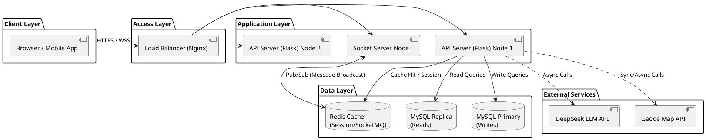
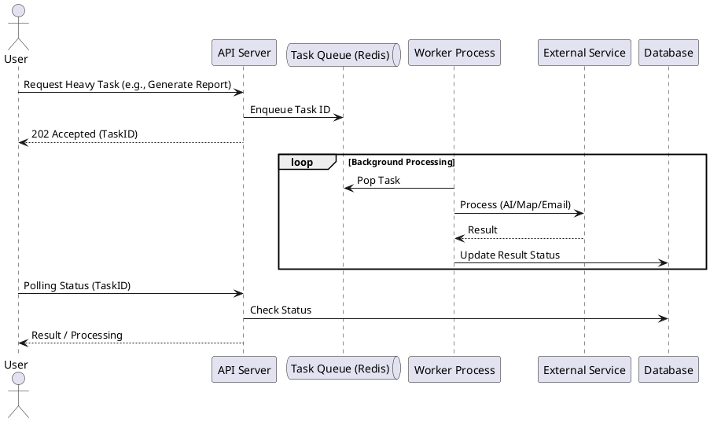

# 非功能性需求分析（性能与系统特性）

## 1. 引言

本文档定义了旅行信息分享应用的非功能性需求 (Non-Functional Requirements, NFRs)，重点关注系统性能、可扩展性、安全性、可用性及可维护性。这些指标直接影响用户体验与系统的长期运营成本，是架构设计的重要约束条件。

## 2. 系统性能需求 (Performance Requirements)

### 2.1 响应时间 (Response Time)
*   **Web API 响应时间**：
    *   **通用 CRUD 接口**（如获取行程详情、加载帖子列表）：95% 的请求应在 **500ms** 内返回。
    *   **复杂计算接口**（如 `calculate_transits` 行程路径规划）：由于涉及外部地图 API 调用及路径计算，95% 的请求应在 **2000ms** 内返回。
    *   **AI 问答接口**（RAG 流式响应）：首字响应时间 (TTFT) 应小于 **1000ms**，后续 token 生成速率应保持平滑（>10 tokens/s），避免用户感知卡顿。
*   **静态资源加载**：
    *   首屏内容渲染（First Contentful Paint, FCP）应在 **1.5s** 内完成。
    *   大图片资源应采用懒加载 (Lazy Loading) 和压缩传输，确保在 3G/4G 网络下也能快速展示。

### 2.2 吞吐量与并发 (Throughput & Concurrency)
*   **并发用户数**：系统设计应支持 **100+ 并发用户** 同时在线操作（如聊天、浏览帖子）。
*   **WebSocket 并发**：单服务器节点应支持至少 **500+ WebSocket 长连接**，用于实时消息推送。
*   **QPS (Queries Per Second)**：
    *   高频接口（如 `GET /feed`）应支持 **50+ QPS**。
    *   数据库读写分离（未来规划）：在读多写少的场景下（如浏览广场帖子），数据库层应能支撑 **200+ QPS** 的查询压力。

### 2.3 数据库性能 (Database Performance)
*   **连接池管理**：
    *   后端应用使用了 SQLAlchemy 的 `QueuePool`，配置 `pool_size=5` (默认) 和 `pool_recycle=3600`。在高并发场景下，应适当调大 `pool_size` 至 **20-50**，并启用 `pool_pre_ping=True` 防止断连错误。
*   **索引优化**：
    *   针对高频查询字段必须建立索引：
        *   `users(username, email)`
        *   `trips(creator_id, visibility, start_date)`
        *   `posts(author_id, created_at, trip_id)`
        *   `activities(location_name)` (用于 RAG 检索)
    *   复杂查询（如 Feed 流的多表关联）应尽量避免全表扫描，通过分页查询 (`limit/offset`) 限制单次数据集大小。

---

## 3. 可扩展性需求 (Scalability)

### 3.1 水平扩展 (Horizontal Scaling)
*   **无状态服务**：应用层 (Application Layer) 设计为无状态 (Stateless)，Session 数据当前存储在 Cookie/内存中，未来应迁移至 **Redis** 集中存储，以便支持多节点负载均衡部署。
*   **WebSocket 扩展**：当前使用 Flask-SocketIO 的默认内存模式。若扩展至多节点，需引入 Redis 作为 Message Queue (通过 `socketio.Server(client_manager=RedisManager(...))` ) 来实现跨进程/跨服务器的消息广播。

### 3.2 垂直扩展 (Vertical Scaling)
*   **AI 推理能力**：当前使用外部 API (DeepSeek)。若未来引入本地轻量级模型，需支持 GPU 资源的垂直扩展配置。

---

## 4. 安全性需求 (Security)

### 4.1 数据安全
*   **密码存储**：严禁明文存储。必须使用加盐哈希算法（如 PBKDF2, Argon2）。当前代码使用了 `werkzeug.security.generate_password_hash` (默认 scrypt/pbkdf2) 符合标准。
*   **传输加密**：所有 HTTP/WebSocket 通信必须通过 **HTTPS/WSS** (TLS 1.2+) 传输，防止中间人攻击。

### 4.2 访问控制
*   **鉴权 (Authentication)**：API 必须校验 Session 有效性。
*   **授权 (Authorization)**：
    *   **资源隔离**：严格检查资源归属权（如 `post.author_id == current_user.id`），防止水平越权。
    *   **角色控制**：Admin 接口必须强制校验 `role='admin'`。

### 4.3 输入验证
*   **SQL 注入防护**：全面使用 SQLAlchemy ORM 进行参数化查询，严禁拼接 SQL 字符串。
*   **XSS 防护**：前端 React 默认会对输出进行转义。后端在存储富文本（如帖子内容）时，若允许 HTML 标签，必须使用 `bleach` 等库进行清洗。

---

## 5. 可用性与可靠性 (Availability & Reliability)

### 5.1 容错设计
*   **外部服务降级**：
    *   **地图服务**：当高德 API 超时或不可用时，系统应捕获异常并返回友好的错误提示，或降级为仅保存文本地址而不计算坐标/路径，不应导致整个行程创建失败。
    *   **AI 服务**：若 LLM 接口响应超时，前端聊天界面应提示“AI 服务繁忙”，不应阻塞主线程。

### 5.2 数据备份
*   **数据库备份**：生产环境应配置每日全量备份 + 增量 Binlog 备份，确保数据可恢复 (RPO < 1小时)。

---

## 6. 系统架构图示

### 6.1 性能优化架构示意 (PlantUML)

以下展示了为满足上述性能需求，系统推荐的逻辑部署架构（引入缓存与负载均衡）：

### 6.2 异步任务处理流程 (PlantUML)

针对耗时的 AI 推理或批量邮件发送任务，建议采用异步队列设计：

## 7. 总结

本应用在初期架构上虽然采用了单体 Flask 应用 + SQLite/MySQL 的简单模式，但已通过 ORM、Blueprint 模块化及分层架构为性能扩展打下了基础。为了达到生产级的高性能与高可用，未来演进的关键路径在于：引入 **Redis 缓存**、实施 **数据库读写分离** 以及 **外部服务调用的异步化**。这些非功能性的满足将确保平台在用户量增长时依然能提供流畅、稳定的服务。
